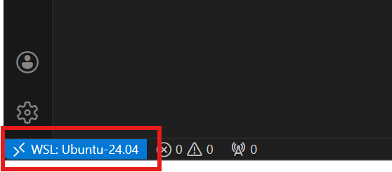

# Sygma - Gestion de Présence Numérique 🚀

## 📋 Table des matières
1. [💻 Configuration de l'environnement](#1-configuration-de-lenvironnement)
2. [📥 Mise en place du dépôt (Clonage)](#2--mise-en-place-du-dépôt-clonage)
3. [⚡️ Premier Setup (Installation)](#3-premier-setup-installation)
4. [🛠 Session de travail quotidienne](#4--session-de-travail-quotidienne)
5. [🌿 Procédure Git & Collaboration](#5--procédure-git--collaboration)
6. [🌐 Accès & Commandes](#6--accès--commandes)
7. [🛠 Gestion des Librairies & Scripts](#7--gestion-des-librairies--scripts)
8. [📊 Visualisation & Requêtes BDD](#8--visualisation--requêtes-bdd)
9. [🧪 Tests & Données de démo](#9--tests--données-de-démo)

---

## 1. Configuration de l'environnement

- **Docker Desktop** : [Installez-le](https://www.docker.com/products/docker-desktop) et assurez-vous qu'il tourne.  
- **VS Code** : Installez l'extension officielle WSL de Microsoft.  
- **Connexion** : Cliquez sur le bouton bleu "><" en bas à gauche de VS Code → **Connect to WSL**.  
  *(Si Ubuntu n'est pas installé, VS Code vous proposera de le faire automatiquement).*

---

## 2. 📥 Mise en place du dépôt (Clonage)

**⚠️ IMPORTANT :** Ne clonez pas le projet dans vos dossiers Windows habituels (Bureau, Documents). Pour que Docker soit rapide, le code doit être dans Linux.

1. Une fois que VS Code affiche **WSL: Ubuntu** en bas à gauche, ouvrez le terminal intégré (`Ctrl + ù`)
   
2. Créez un dossier pour vos projets :
   ```bash
   cd ~
   mkdir -p projects && cd projects
   ```

3. Clonez le dépôt :
   ```bash
   git clone https://github.com/hyosua/sygma.git
   cd sygma
   ```

4. Lancez VS Code dans ce dossier :
   ```bash
   code .
   ```

---

## 3. Premier Setup (Installation)

Une fois le projet ouvert dans VS Code (via WSL) :

### Configuration d'environnement

```bash
cp backend/.env.example backend/.env
```
(Demandez les accès pour les variables env si je ne vous les ai pas déjà donnés).

### Lancement du projet

Vous avez deux méthodes pour installer les dépendances et démarrer le projet :

#### Option A : La méthode rapide (Recommandé)
Utilisez le script automatisé qui s'occupe de tout (build, install, migrations, seed) :

```bash
chmod +x sygma.sh
./sygma.sh install
```

#### Option B : La méthode manuelle
Si vous préférez exécuter les commandes étape par étape :

1. **Installation des dépendances** (une seule fois) :
```bash
docker compose build
docker compose run --rm backend composer install
docker compose run --rm backend npm install
docker compose run --rm frontend npm install
```

2. **Démarrage des serveurs** :
```bash
docker compose up -d
```

3. **Initialisation de la BDD** :
```bash
docker compose exec backend php artisan key:generate
docker compose exec backend php artisan migrate --seed
```
---

## 4. 🛠 Session de travail quotidienne

Plus besoin de tout réinstaller ! À chaque nouvelle session :

- **Récupérer le travail** : `git pull origin main`
- **Mettre à jour** : `./sygma.sh update` (Installe les nouvelles dépendances et applique les migrations)
- **Démarrer les serveurs** : `./sygma.sh start`
- **Travailler** : Les modifications de code sont visibles en temps réel.
- **Quitter** : `./sygma.sh stop` (libère la RAM de votre PC).

---

## 5. 🌿 Procédure Git & Collaboration

Pour un historique propre et éviter les conflits :

### Nouvelle tâche

Créez toujours une branche :
```bash
git checkout -b "feat/ma-fonctionnalite"
```

### Avant de Push

```bash
git add .
git commit -m "Message clair et concis"
git pull origin main  # pour fusionner le travail récent des autres
```

### Envoyer

```bash
git push origin feat/ma-fonctionnalite
```

---

## 6. 🌐 Accès & Commandes

| Service | URL / Port |
|---------|-----------|
| Front-end (React) | http://localhost:3000 |
| Back-end (API) | http://localhost:8000 |
| Adminer (BDD) | http://localhost:8080 |
| PostgreSQL | Port 5432 |

---
## 7. 🛠 Gestion des Librairies & Scripts

Pour ajouter une librairie (ex: un package Composer ou un module NPM), vous ne devez pas l'installer sur votre Windows. Vous devez demander au conteneur de le faire.

### 1. La méthode "Raccourci" (Script Sygma)
J'ai créé un script `sygma` pour vous simplifier la vie. 

**Configuration initiale (recommandé) :**
Pour pouvoir taper `sygma` au lieu de `./sygma.sh`, lancez une fois :
```bash
chmod +x sygma.sh
./sygma.sh setup
source ~/.bashrc  # ou source ~/.zshrc
```

Désormais, vous pouvez utiliser ces commandes partout :
* **Installer tout** : `sygma install`
* **Démarrer** : `sygma start`
* **Arrêter** : `sygma stop`
* **Mettre à jour (post-pull)** : `sygma update`
* **Vider/Réinitialiser BDD** : `sygma fresh`
* **Réparer** : `sygma repair`

### 2. Utilisation des outils (via le script)
Plus besoin de taper de longues commandes Docker, utilisez les raccourcis :

**Pour le Backend (PHP/Laravel) :**
```bash
sygma composer require <package>  # Installer un package
sygma artisan make:model <Nom>    # Créer un modèle
sygma artisan migrate             # Lancer les migrations
```

**Pour le Frontend (React) :**
```bash
sygma npm install <package>       # Installer un package
```

*Note : Ces commandes s'exécutent directement à l'intérieur des conteneurs Docker.*

---

## 8. 📊 Visualisation & Requêtes BDD

### Adminer (Simple - Sans installation)
C'est une interface web déjà prête.
1. Ouvrez [http://localhost:8080](http://localhost:8080) dans votre navigateur.
2. Connectez-vous avec :
   - **Système** : `PostgreSQL`
   - **Serveur** : `db`
   - **Utilisateur** : `sygma`
   - **Mot de passe** : `sygma_pass`
   - **Base de données** : `sygma`
---

## 💡 Astuces de secours

- **Logs en direct** : `docker compose logs -f`
- **Réinitialiser un conteneur** : `docker compose restart backend`
- **Erreur de permissions** : `docker compose exec backend chown -R www-data:www-data storage`

---

## 9. 🧪 Tests & Données de démo

### Peupler la base de données (Seeding)
Pour remplir votre base avec des données de test (étudiants, enseignants, groupes LP Dawii/ASRI), utilisez :
```bash
sygma artisan db:seed --class=GroupeSeeder
```
*Note : Pour tout réinitialiser (supprime tout et recrée les données de base) : `sygma fresh`.*

### Exécuter les tests
Les tests permettent de vérifier que les fonctionnalités (comme la gestion des groupes) fonctionnent correctement.

**Lancer tous les tests :**
```bash
sygma artisan test
```

**Lancer uniquement les tests liés aux groupes :**
```bash
sygma artisan test --filter GroupManagementTest
```