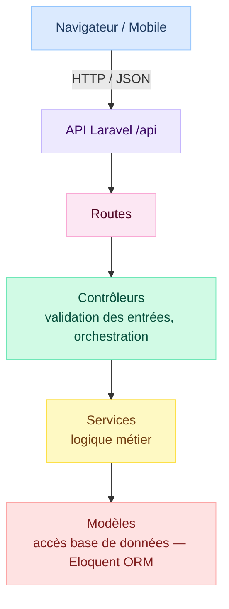
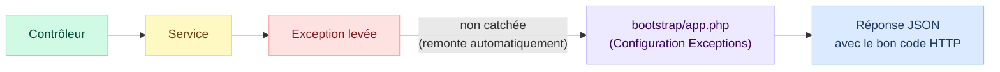
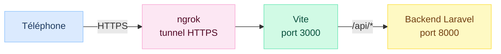
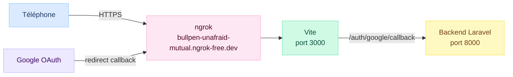

# Documentation Technique — Sygma

## Table des matières

1. [Présentation du projet](#présentation-du-projet)
2. [Stack technique](#stack-technique)
3. [Architecture générale](#architecture-générale)
4. [Modèle de données](#modèle-de-données)
5. [Architecture backend](#architecture-backend)
6. [Gestion des erreurs HTTP](#gestion-des-erreurs-http)
7. [Authentification et autorisations](#authentification-et-autorisations)
8. [Tests](#tests)
9. [Tests sur mobile](#tests-sur-mobile)
10. [CI/CD](#cicd)
11. [Sécurité](#sécurité)

---

## Présentation du projet

Sygma est une application web de gestion de présence numérique destinée aux établissements d'enseignement supérieur. Elle permet aux enseignants de démarrer des sessions d'émargement par QR Code ou manuellement, aux étudiants de valider leur présence, et aux gestionnaires de consulter et valider les feuilles de présence.

**Rôles utilisateurs :**

| Rôle | Responsabilités |
|---|---|
| Étudiant | Scanner le QR Code ou être marqué présent manuellement |
| Enseignant | Créer/gérer des séances, démarrer et clôturer l'émargement |
| Gestionnaire | Consulter, valider et exporter les feuilles de présence |

---

## Stack technique

| Composant | Technologie |
|---|---|
| Backend | Laravel 11 (PHP 8.2+), API REST |
| Frontend | React 18 / Vite |
| Base de données (dev) | PostgreSQL (`sygma`, via Docker) |
| Base de données (tests) | PostgreSQL (`sygma_test`, isolée de la base de dev) |
| Authentification | Laravel Sanctum / Google OAuth 2.0 |
| Gestion des rôles | Spatie Laravel Permission |
| Conteneurisation | Docker / Docker Compose |
| CI/CD | GitHub Actions |

---

## Architecture générale

L'application suit une architecture **client-serveur** découplée :

- Le **frontend** (React) consomme l'API REST via des appels HTTP
- Le **backend** (Laravel) expose une API JSON préfixée `/api`
- Les deux communiquent exclusivement en JSON



---

## Modèle de données

Le schéma complet (MCD/MLD) est disponible dans `docs/specs/MCD/`.

**Tables principales :**

| Table | Description |
|---|---|
| `users` | Étudiants, enseignants et gestionnaires, avec rôles Spatie et `google_id` pour OAuth |
| `groupes` | Groupes d'étudiants |
| `cours` | Matières enseignées |
| `seances` | Séances planifiées (`cours_id`, `enseignant_id`, `groupe_id`, `debut_a`, `fin_a`, `salle`) |
| `inscriptions` | Inscription étudiant ↔ cours |
| `sessions_emargement` | Session d'émargement liée à une séance (`jeton`, `jeton_expire_a`, `cloture_a`, `is_methode_qr`, lat/lon) |
| `presences` | Présence enregistrée (`session_id`, `etudiant_id`, `statut`, `scanne_a`, lat/lon) |
| `invitations_gestionnaire` | Invitation en attente d'un gestionnaire (`email`, `token`, `expires_at`, `used_at`) |

---

## Architecture backend

### Couche Service

La logique métier est isolée dans des classes de service, séparée des contrôleurs :

**`EmargementService`** — gestion du cycle de vie d'une session d'émargement :

| Méthode | Rôle |
|---|---|
| `demarrerSession(Seance, bool, array)` | Crée une `SessionEmargement`, génère le jeton |
| `validerPresenceParJeton(jeton, User, array)` | Valide un scan QR (jeton, expiration, séance active, inscription, doublon) |
| `enregistrerPresence(SessionEmargement, User)` | Enregistre une présence manuelle |
| `rafraichirJeton(SessionEmargement)` | Rotation du jeton (nouveau jeton + 20s d'expiration) |
| `cloturerSession(SessionEmargement)` | Met `cloture_a = now()` (session inactive si `cloture_a` non null) |

**`InvitationGestionnaireService`** — gestion du cycle de vie des invitations gestionnaire :

| Méthode | Rôle |
|---|---|
| `creerInvitation(email)` | Crée ou réinitialise une invitation (token 32 car., expiration 48h), envoie l'email |
| `validerToken(token)` | Vérifie qu'un token existe, n'est pas expiré et n'a pas déjà été utilisé |
| `inscrireViaToken(token, data)` | Crée le compte gestionnaire, assigne le rôle, marque l'invitation comme utilisée |
| `supprimerInvitation(id)` | Supprime une invitation en attente |
| `getInvitations()` | Liste toutes les invitations (ordre anti-chronologique) |

**Règles métier notables :**
- Durée de validité d'une invitation : **48 heures** (constante `DUREE_VALIDITE_INVITATION`)
- `updateOrCreate` sur l'email : réinviter un même email renouvelle le token sans créer de doublon
- L'inscription via token consomme l'invitation (`used_at = now()`) — elle ne peut être utilisée qu'une fois

**`SeanceService`** — gestion des séances :

| Méthode | Rôle |
|---|---|
| `getSeances(array, User)` | Liste paginée avec filtres (statut, enseignant, groupe, dates) selon les droits |
| `getSeance(Seance)` | Détail d'une séance avec relations et nombre d'inscrits |
| `creerSeance(array)` | Crée une séance après vérification des conflits |
| `modifierSeance(Seance, array)` | Modifie une séance après vérification des conflits |
| `supprimerSeance(Seance)` | Supprime une séance |

**Règles métier notables :**
- Durée de validité d'un jeton QR : **20 secondes** (constante `DUREE_VALIDITE_JETON`)
- Vérification de conflit de créneau pour l'enseignant et la salle à la création/modification d'une séance
- Impossible de modifier ou supprimer une séance si une session d'émargement est active
- **Sécurité** : Seul l'enseignant responsable d'une séance ou un gestionnaire peut modifier/supprimer une séance ou agir sur sa session d'émargement.

### Exceptions métier

Les exceptions métier sont organisées par domaine dans `app/Exceptions/` :

```
app/Exceptions/
├── NonAutoriseException.php
├── Emargement/
│   ├── DejaEmargeException.php
│   ├── EtudiantNonInscritException.php
│   ├── JetonExpireException.php
│   └── JetonInvalideException.php
├── Invitation/
│   ├── TokenExpireException.php
│   └── TokenDejaUtiliseException.php
└── Seance/
    ├── ConflitSeanceException.php
    ├── SalleOccupeeException.php
    ├── SeanceNonActiveException.php
    ├── SeancePasseeException.php
    └── SessionEmargementActiveException.php
```

---

## Gestion des erreurs HTTP

### Principe

Les exceptions métier ne sont **jamais catchées dans les contrôleurs**. Elles remontent automatiquement jusqu'à la configuration globale dans `bootstrap/app.php`, qui peut les traduire en réponses JSON cohérentes si nécessaire. Les exceptions qui implémentent une méthode `render()` (comme `NonAutoriseException`) sont gérées nativement par Laravel.



Ce choix évite la duplication de code et garantit une réponse uniforme sur toutes les routes.

### Tableau des codes HTTP

| Code | Signification | Exemples |
|---|---|---|
| `200` | Succès (lecture, action) | GET séances, clôturer session |
| `201` | Ressource créée | Créer séance, créer utilisateur |
| `204` | Succès sans contenu | Supprimer séance |
| `403 Forbidden` | Non autorisé | Action par un autre enseignant |
| `404` | Ressource introuvable | ID inexistant en base |
| `409 Conflict` | Conflit métier | Créneau déjà occupé, salle déjà prise, doublon de présence |
| `422 Unprocessable` | Règle métier non respectée | Jeton invalide/expiré, séance non active, étudiant non inscrit, doublon email |
| `500` | Erreur interne | Erreur non prévue (voir section Sécurité) |

### Format de réponse d'erreur

Toutes les erreurs retournent un JSON de la forme :

```json
{
  "message": "Description de l'erreur."
}
```

---

## Authentification et autorisations

L'authentification est assurée par **Laravel Sanctum** (tokens de session) et **Google OAuth 2.0**.

Les rôles (`étudiant`, `enseignant`, `gestionnaire`) sont gérés par **Spatie Laravel Permission**.

Les routes API sont protégées par le middleware `auth:sanctum`. Certaines routes critiques possèdent des vérifications d'identité supplémentaires dans les contrôleurs pour vérifier la propriété des ressources (ex: une séance appartient à son enseignant).

---

## Tests

Les tests sont situés dans `backend/tests/` et utilisent **PHPUnit** avec `RefreshDatabase`.

Ils tournent sur une base PostgreSQL dédiée (`sygma_test`), isolée de la base de dev (`sygma`). 

| Fichier | Couverture |
|---|---|
| `EmargementServiceTest.php` | Tests unitaires du service (démarrage session, scan QR valide/invalide/expiré, doublon, séance inactive, étudiant non inscrit) |
| `SeanceControllerTest.php` | Tests des routes séances (liste, détail, suppression, autorisations, 404) |
| `SessionEmargementTest.php` | Tests des routes d'émargement (démarrage, clôture, statut, présence manuelle) |
| `EmargementSecurityTest.php` | Tests spécifiques sur les autorisations d'émargement |
| `GoogleAuthTest.php` | Tests du cycle d'authentification Google OAuth |
| `InvitationGestionnaireTest.php` | Tests du flux d'invitation gestionnaire (inviter, lister, annuler, vérifier token, s'inscrire, renvoyer — envoi mail inclus) |

**Lancer les tests :**

```bash
make test
```

---

## Tests sur mobile

### Architecture

Le frontend Vite est configuré comme **proxy inverse** vers le backend :



Tous les appels API passent par Vite, qui les transfère au backend via le réseau Docker interne (`http://backend:8000`). Le téléphone ne communique qu'avec un seul serveur, ce qui évite les problèmes CORS et la nécessité de plusieurs tunnels.

### Configuration

- `VITE_API_URL=/api` dans `frontend/.env` — URL relative, fonctionne sur tous les environnements
- Proxy déclaré dans `vite.config.js` : `/api` → `http://backend:8000`
- `allowedHosts: true` dans `vite.config.js` pour autoriser les domaines ngrok

### Lancer les tests mobiles

**Prérequis (une seule fois) :**
```bash
ngrok config add-authtoken <ton_token>  # compte gratuit sur dashboard.ngrok.com
```

**Workflow :**
```bash
make mobile       # lance ngrok, affiche l'URL + QR code à scanner
# tester sur le téléphone...
make mobile-stop  # arrête ngrok
```

`make mobile` :
1. Démarre ngrok sur le port 3000 (tunnel HTTPS)
2. Récupère l'URL publique via l'API locale ngrok
3. Affiche l'URL et un QR code à scanner directement dans le terminal

### Fichiers concernés

| Fichier | Rôle |
|---|---|
| `ngrok.yml` | Config du tunnel ngrok (port 3000) |
| `scripts/mobile.sh` | Script d'automatisation ngrok |
| `scripts/mobile-stop.sh` | Arrêt ngrok |
| `frontend/.env` | `VITE_API_URL=/api` |

---

### Mode démo mobile avec Google Auth

Par défaut, Google Auth est configuré pour fonctionner en local (`localhost`). Pour une démonstration sur mobile (ngrok), un script dédié switche la configuration sans modifier manuellement le `.env`.

#### Pourquoi un script séparé

Le callback Google OAuth doit pointer vers une URL publique. En mode local, il pointe vers `http://localhost:8000/auth/google/callback`. Sur mobile via ngrok, il faut que ce callback soit accessible depuis Internet.

La solution exploite le **proxy Vite déjà en place** : le callback Google passe par le tunnel ngrok frontend (port 3000), qui le transfère au backend via le proxy interne. Un seul tunnel ngrok suffit.



#### Prérequis (une seule fois)

Enregistrer l'URI de callback ngrok dans [Google Cloud Console](https://console.cloud.google.com) → APIs & Services → Credentials → OAuth 2.0 Client → **Authorized redirect URIs** :

```
https://bullpen-unafraid-mutual.ngrok-free.dev/auth/google/callback
```

#### Workflow

```bash
make demo-start   # met à jour .env, redémarre le backend, lance ngrok + QR code
# démonstration sur mobile...
make demo-stop    # restaure .env localhost, redémarre le backend, arrête ngrok
```

`make demo-start` modifie automatiquement deux variables dans `backend/.env` :

| Variable | Valeur locale | Valeur démo mobile |
|---|---|---|
| `GOOGLE_REDIRECT_URI` | `http://localhost:8000/auth/google/callback` | `https://bullpen-unafraid-mutual.ngrok-free.dev/auth/google/callback` |
| `FRONTEND_URL` | `http://localhost:3000` | `https://bullpen-unafraid-mutual.ngrok-free.dev` |

`make demo-stop` restaure les valeurs localhost.

#### Fichiers concernés

| Fichier | Rôle |
|---|---|
| `scripts/demo-start.sh` | Activation du mode démo (env + ngrok) |
| `scripts/demo-stop.sh` | Restauration du mode local |

---

## CI/CD

Le pipeline CI/CD est décrit en détail dans `docs/ci-cd.md`.

**Résumé :**
- Déclenché sur chaque push et Pull Request vers `main`
- Backend : lint PHP (Pint + PHPCS) + tests PHPUnit (**bloquant**)
- Frontend : lint ESLint + build Vite (**bloquant**)
- Hook pre-commit local : reformatage automatique avant chaque commit

---

## Sécurité

### Gestion des erreurs (OWASP)

En production, Laravel masque les stack traces si `APP_DEBUG=false`. Un rendu personnalisé pour les erreurs `NotFoundHttpException` est configuré dans `bootstrap/app.php` pour les requêtes API.

### Anti-fraude QR Code

- Le jeton QR expire toutes les **20 secondes** et est renouvelé à chaque cycle
- Un étudiant ne peut émarger qu'une seule fois par session (vérification de doublon)
- Vérification d'identité : les enseignants ne peuvent agir que sur leurs propres séances.
