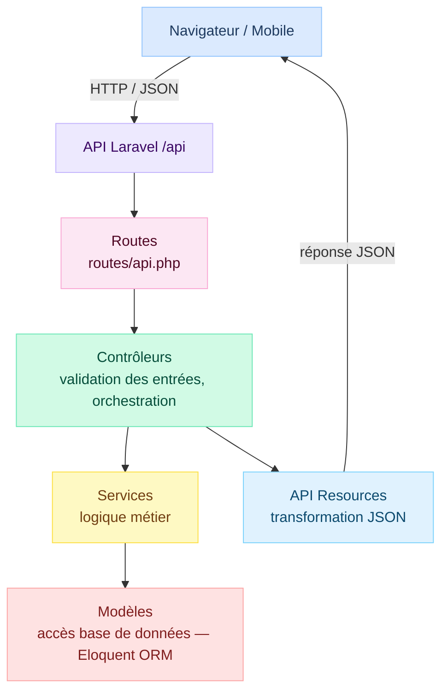
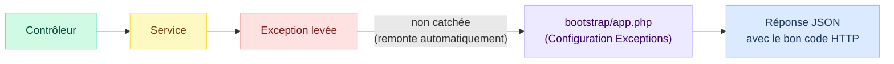
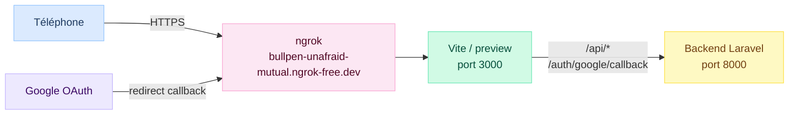

# Documentation Technique — Sygma

## Table des matières

1. [Présentation du projet](#présentation-du-projet)
2. [Stack technique](#stack-technique)
3. [Infrastructure Docker](#infrastructure-docker)
4. [Architecture générale](#architecture-générale)
5. [Modèle de données](#modèle-de-données)
6. [Architecture backend](#architecture-backend)
7. [Architecture frontend](#architecture-frontend)
8. [API REST](#api-rest)
9. [Gestion des erreurs HTTP](#gestion-des-erreurs-http)
10. [Authentification et autorisations](#authentification-et-autorisations)
11. [Tests](#tests)
12. [CI/CD](#cicd)
13. [Tests sur mobile](#tests-sur-mobile)
14. [Sécurité](#sécurité)

---

## Présentation du projet

Sygma est une application web de gestion de présence numérique destinée aux établissements d'enseignement supérieur. Elle permet aux enseignants de démarrer des sessions d'émargement par QR Code ou manuellement, aux étudiants de valider leur présence, et aux gestionnaires de consulter et valider les feuilles de présence.

**Rôles utilisateurs :**

| Rôle | Responsabilités |
|---|---|
| Étudiant | Scanner le QR Code, consulter ses présences et ses cours |
| Enseignant | Créer/gérer des séances, démarrer et clôturer l'émargement, valider manuellement |
| Gestionnaire | Consulter, valider et exporter les feuilles de présence, gérer les comptes, inviter des gestionnaires |

---

## Stack technique

| Composant | Technologie | Version |
|---|---|---|
| Backend | Laravel, API REST | 11 (PHP 8.2+) |
| Frontend | React / Vite | React 19, Vite 7 |
| Base de données (dev) | PostgreSQL (`sygma`, via Docker) | 16 |
| Base de données (tests) | PostgreSQL (`sygma_test`, isolée de la base de dev) | 16 |
| Authentification | Laravel Sanctum + Google OAuth 2.0 | Sanctum 4.0 |
| Gestion des rôles | Spatie Laravel Permission | 6.x |
| Export | Maatwebsite Excel + barryvdh/laravel-dompdf | - |
| Scan QR | html5-qrcode (frontend) | 2.3.x |
| Routing frontend | React Router DOM | 7.x |
| Conteneurisation | Docker / Docker Compose | - |
| CI/CD | GitHub Actions | - |

---

## Infrastructure Docker

L'environnement de développement est entièrement conteneurisé. **Toutes les interactions avec le projet passent par `make`** — jamais directement par `php artisan` ou `npm`.

**Services Docker (`docker-compose.yml`) :**

| Conteneur | Image | Port | Rôle |
|---|---|---|---|
| `sygma-backend` | Image custom (PHP 8.2) | `8000` | Serveur Laravel (`php artisan serve`) |
| `sygma-frontend` | Image custom (Node 20) | `3000` | Serveur de dev Vite |
| `sygma-db` | `postgres:16-alpine` | `5432` | Base PostgreSQL |
| `sygma-adminer` | `adminer` | `8080` | Interface d'administration BDD |
| `sygma-mailpit` | `axllent/mailpit` | `8025` (web) / `1025` (SMTP) | Interception des emails en dev |

**Commandes Makefile principales :**

| Commande | Action |
|---|---|
| `make start` | Lancer tous les services |
| `make stop` | Arrêter les services |
| `make update` | Composer install + npm install + migrations |
| `make fresh` | Réinitialiser la BDD (`migrate:fresh --seed`) |
| `make test` | Lancer PHPUnit |
| `make lint-fix` | Corriger le lint PHP (Pint + PHPCBF) et JS (ESLint) |
| `make lint-check` | Vérifier le lint sans corriger |
| `make artisan ARGS="..."` | Exécuter une commande Artisan |
| `make mobile` | Lancer l'environnement mobile (ngrok + build preview) |
| `make mobile-stop` | Restaurer l'environnement local |

---

## Architecture générale

L'application suit une architecture **client-serveur découplée** :

- Le **frontend** (React) consomme l'API REST via des appels HTTP
- Le **backend** (Laravel) expose une API JSON préfixée `/api`
- Les deux communiquent exclusivement en JSON



---

## Modèle de données

Le schéma complet (MCD/MLD) est disponible dans `docs/specs/MCD/`.

**Tables principales :**

| Table | Description |
|---|---|
| `users` | Étudiants, enseignants et gestionnaires — champs : `nom`, `prenom`, `email`, `password` (nullable pour OAuth), `ine`, `google_id`, `verification_token`, rôles Spatie |
| `groupes` | Groupes d'étudiants (`nom`, `promotion`) |
| `cours` | Matières enseignées (`nom`, `enseignant_id`) |
| `seances` | Séances planifiées (`cours_id`, `enseignant_id`, `groupe_id`, `debut_a`, `fin_a`, `salle`) |
| `inscriptions` | Inscription étudiant ↔ cours |
| `sessions_emargement` | Session liée à une séance (`jeton`, `jeton_expire_a`, `cloture_a`, `is_methode_qr`, `latitude`, `longitude`) |
| `presences` | Présence enregistrée (`session_id`, `etudiant_id`, `statut`, `scanne_a`, `latitude`, `longitude`) |
| `invitations_gestionnaire` | Invitation gestionnaire (`email`, `token`, `expires_at`, `used_at`, `demande_a`) |

**Statut d'une séance (calculé, non stocké) :**

| Valeur | Condition |
|---|---|
| `en_cours` | `debut_a <= now() <= fin_a` |
| `a_venir` | `debut_a > now()` |
| `terminee` | `fin_a < now()` |

---

## Architecture backend

### Structure des répertoires

```
backend/app/
├── Http/
│   ├── Controllers/       # Orchestration + validation des requêtes
│   └── Resources/         # Transformation JSON des réponses
│       ├── CoursResource.php
│       ├── EnseignantResource.php
│       ├── EtudiantResource.php
│       ├── GroupeResource.php
│       ├── InvitationResource.php
│       ├── SeanceResource.php
│       └── UserResource.php
├── Services/              # Logique métier
│   ├── EmargementService.php
│   ├── SeanceService.php
│   ├── InvitationGestionnaireService.php
│   ├── CoursService.php
│   └── ImportCompteService.php
├── Exceptions/            # Exceptions métier par domaine
│   ├── NonAutoriseException.php
│   ├── CoursExisteDejaException.php
│   ├── Emargement/
│   ├── Invitation/
│   └── Seance/
└── Models/                # Modèles Eloquent
```

### Couche Service

La logique métier est isolée dans des classes de service, séparée des contrôleurs.

**`EmargementService`** — cycle de vie d'une session d'émargement :

| Méthode | Rôle |
|---|---|
| `demarrerSession(Seance, bool, array)` | Crée une `SessionEmargement`, génère le jeton |
| `validerPresenceParJeton(jeton, User, array)` | Valide un scan QR (jeton, expiration, séance active, inscription, doublon) |
| `enregistrerPresence(SessionEmargement, User)` | Enregistre une présence manuelle |
| `rafraichirJeton(SessionEmargement)` | Rotation du jeton (nouveau jeton + 20 s d'expiration) |
| `cloturerSession(SessionEmargement)` | Met `cloture_a = now()` |

**`SeanceService`** — gestion des séances :

| Méthode | Rôle |
|---|---|
| `getSeances(array, User)` | Liste paginée avec filtres (statut, enseignant, groupe, dates) selon les droits |
| `getSeance(Seance)` | Détail d'une séance avec relations et nombre d'inscrits |
| `creerSeance(array)` | Crée une séance après vérification des conflits |
| `modifierSeance(Seance, array)` | Modifie une séance après vérification des conflits |
| `supprimerSeance(Seance)` | Supprime une séance |

**`InvitationGestionnaireService`** — cycle de vie des invitations :

| Méthode | Rôle |
|---|---|
| `creerInvitation(email)` | Crée ou réinitialise une invitation (token 32 car., expiration 48 h), envoie l'email |
| `validerToken(token)` | Vérifie existence, expiration, non-utilisation |
| `inscrireViaToken(token, data)` | Crée le compte gestionnaire, assigne le rôle, marque l'invitation comme utilisée |
| `supprimerInvitation(id)` | Supprime une invitation en attente |
| `getInvitations()` | Liste toutes les invitations (ordre anti-chronologique) |

**`ImportCompteService`** — import en masse de comptes :

| Méthode | Rôle |
|---|---|
| `importer(UploadedFile)` | Parse un fichier CSV/Excel, valide toutes les lignes, puis crée les comptes en transaction — tout ou rien |

Chaque compte importé reçoit un token de vérification email. L'email de confirmation est envoyé automatiquement.

**`CoursService`** — gestion des cours :

CRUD de cours avec vérification de doublon sur le nom (`CoursExisteDejaException`).

**Règles métier notables :**

- Durée de validité d'un jeton QR : **20 secondes** (constante `DUREE_VALIDITE_JETON`)
- Durée de validité d'une invitation : **48 heures** (constante `DUREE_VALIDITE_INVITATION`)
- Conflit de créneau vérifié à la création/modification d'une séance (enseignant + salle)
- Impossible de modifier ou supprimer une séance si une session d'émargement est active
- Seul l'enseignant responsable ou un gestionnaire peut agir sur une séance

### Exceptions métier

Les exceptions métier sont organisées par domaine dans `app/Exceptions/` :

```
app/Exceptions/
├── NonAutoriseException.php
├── CoursExisteDejaException.php
├── Emargement/
│   ├── DejaEmargeException.php
│   ├── EtudiantNonInscritException.php
│   ├── JetonExpireException.php
│   └── JetonInvalideException.php
├── Invitation/
│   ├── TokenExpireException.php
│   └── TokenDejaUtiliseException.php
└── Seance/
    ├── ConflitSeanceException.php
    ├── SalleOccupeeException.php
    ├── SeanceNonActiveException.php
    ├── SeancePasseeException.php
    └── SessionEmargementActiveException.php
```

---

## Architecture frontend

### Structure des pages

```
frontend/src/
├── pages/
│   ├── Auth/              # Callback Google OAuth
│   ├── Email/             # Confirmation email + vérification token
│   ├── Enseignant/        # Espace enseignant
│   │   ├── AccueilEnseignantPage.jsx   # Liste des séances
│   │   ├── SessionQR.jsx               # Gestion session QR en direct
│   │   ├── PresencesEnseignantPage.jsx # Archives
│   │   ├── MesCoursPage.jsx
│   │   └── ProfilEnseignantPage.jsx
│   ├── Etudiant/          # Espace étudiant
│   │   ├── ScanPresence.jsx            # Scanner QR Code
│   │   ├── MesPresences.jsx
│   │   └── MesCoursEtudiantPage.jsx
│   ├── Gestionnaire/      # Espace gestionnaire
│   │   ├── AccueilGestionnairePage.jsx
│   │   ├── PresencesGestionnairePage.jsx
│   │   ├── ImportComptesPage.jsx       # Import CSV/Excel
│   │   └── DemandeGestionnairePage.jsx
│   ├── Inscription/       # Inscription + choix de rôle
│   └── Login/             # Page de connexion
├── layouts/               # EnseignantLayout, GestionnaireLayout, EtudiantLayout
├── components/            # CookieBanner, Headers par rôle
└── styles/                # variables.css, thèmes
```

### Routing (`App.jsx`)

| Route | Composant | Accès |
|---|---|---|
| `/` | Redirect `/login` | Public |
| `/login` | `LoginChoicePage` | Public |
| `/inscription` | `InscriptionPage` | Public |
| `/inscription/gestionnaire/:token` | `InscriptionGestionnairePage` | Public (lien email) |
| `/demande-gestionnaire` | `DemandeGestionnairePage` | Public |
| `/auth/google/succes` | `GoogleSuccesPage` | Public |
| `/email/verify/:token` | `EmailVerifyPage` | Public |
| `/enseignant/accueil` | `AccueilEnseignantPage` | Enseignant |
| `/enseignant/session/:seanceId` | `SessionQR` | Enseignant |
| `/enseignant/archives` | `PresencesEnseignantPage` | Enseignant |
| `/enseignant/mes-cours` | `MesCoursPage` | Enseignant |
| `/gestionnaire/` | `AccueilGestionnairePage` | Gestionnaire |
| `/gestionnaire/presences` | `PresencesGestionnairePage` | Gestionnaire |
| `/gestionnaire/import` | `ImportComptesPage` | Gestionnaire |
| `/etudiant/scan` | `ScanPresence` | Étudiant |
| `/etudiant/mes-presences` | `MesPresences` | Étudiant |
| `/etudiant/mes-cours` | `MesCoursEtudiantPage` | Étudiant |

---

## API REST

**Base URL :** `http://localhost:8000/api`  
**Format :** JSON  
**Authentification :** Laravel Sanctum (cookie de session SPA ou token Bearer)

Toutes les erreurs retournent `{ "message": "..." }` avec le code HTTP approprié.  
Les dates sont en **ISO 8601 UTC** (`2026-03-12T10:41:12.000000Z`).

---

### Authentification

| Méthode | Endpoint | Auth | Description |
|---|---|---|---|
| `POST` | `/login` | Non | Connexion email/password — retourne cookie de session |
| `POST` | `/logout` | Oui | Invalide la session |
| `POST` | `/register` | Non | Inscription étudiant ou enseignant |
| `GET` | `/email/verify/{token}` | Non | Activation du compte par email |
| `POST` | `/auth/google/finaliser` | Non | Finalise la connexion Google OAuth |

**Corps `/login` :** `email`, `password`  
**Corps `/register` :** `nom`, `prenom`, `email`, `password`, `role` (`etudiant` ou `enseignant`)

---

### Séances

| Méthode | Endpoint | Auth | Description |
|---|---|---|---|
| `GET` | `/seances` | Oui | Liste paginée avec filtres |
| `GET` | `/seances/{id}` | Oui | Détail d'une séance |
| `POST` | `/seances` | Enseignant/Gestionnaire | Créer une séance |
| `PATCH` | `/seances/{id}` | Enseignant/Gestionnaire | Modifier une séance |
| `DELETE` | `/seances/{id}` | Enseignant/Gestionnaire | Supprimer une séance |
| `GET` | `/seances/{id}/sessions-emargement` | Oui | Sessions d'émargement d'une séance |

**Filtres `GET /seances` (query string) :**

| Paramètre | Type | Description |
|---|---|---|
| `statut` | string | `en_cours`, `a_venir`, `terminee` |
| `enseignant_id` | integer | Filtre par enseignant |
| `groupe_id` | integer | Filtre par groupe |
| `cours_id` | integer | Filtre par cours |
| `date_debut` | datetime | Séances commençant après |
| `date_fin` | datetime | Séances finissant avant |
| `par_page` | integer | Résultats par page (défaut : 15, max : 50) |
| `page` | integer | Numéro de page |

**Réponse `GET /seances` :**
```json
{
  "data": [{ "id": 61, "cours_id": 1, "enseignant_id": 67, "groupe_id": 1,
             "salle": "B12", "debut_a": "2026-03-12T10:41:12Z", "fin_a": "2026-03-12T12:46:12Z", "statut": "en_cours" }],
  "current_page": 1, "last_page": 3, "par_page": 15, "total": 42
}
```

**Réponse `GET /seances/{id}` :** même structure + `nombre_inscrits`, `cours`, `enseignant`, `groupe` en relations.

**Corps `POST /seances` :** `cours_id`, `groupe_id`, `debut_a`, `fin_a`, `salle` (optionnel)

**Erreurs séances :**

| Code | Cause |
|---|---|
| `409` | Conflit de créneau (enseignant ou salle déjà occupé) |
| `422` | Séance non active (émargement impossible) |
| `403` | L'enseignant n'est pas responsable de la séance |

---

### Sessions d'émargement

| Méthode | Endpoint | Auth | Description |
|---|---|---|---|
| `POST` | `/sessions-emargement` | Enseignant/Gestionnaire | Démarrer une session |
| `GET` | `/sessions-emargement/{id}/statut` | Enseignant/Gestionnaire | Statut + jeton courant |
| `POST` | `/sessions-emargement/{id}/refresh` | Enseignant/Gestionnaire | Forcer la rotation du jeton |
| `POST` | `/sessions-emargement/{id}/cloturer` | Enseignant/Gestionnaire | Clôturer la session |

**Corps `POST /sessions-emargement` :**

| Champ | Type | Requis | Description |
|---|---|---|---|
| `seance_id` | integer | Oui | ID de la séance |
| `is_methode_qr` | boolean | Oui | `true` = QR Code, `false` = manuel |
| `latitude` | float | Non | Coordonnées GPS de la salle |
| `longitude` | float | Non | Coordonnées GPS de la salle |

**Réponse `POST /sessions-emargement` (201) :**
```json
{ "id": 5, "seance_id": 61, "is_methode_qr": true,
  "jeton": "aB3xKq...", "jeton_expire_a": "2026-03-12T10:42:00Z", "cloture_a": null }
```

**Réponse `GET /statut` (200) :**
```json
{ "id": 5, "jeton": "aB3xKq...", "jeton_expire_a": "2026-03-12T10:42:00Z",
  "cloture_a": null, "nombre_presents": 12 }
```

> Le jeton expire toutes les **20 secondes**. `GET /statut` rafraîchit automatiquement le jeton s'il est expiré (méthode QR, session non clôturée). Poller cet endpoint pour maintenir le QR Code à jour.

---

### Présences

| Méthode | Endpoint | Auth | Description |
|---|---|---|---|
| `POST` | `/presences/valider-qr` | Étudiant/Gestionnaire | Valider via scan QR Code |
| `POST` | `/presences/valider-manuel` | Enseignant/Gestionnaire | Marquer présent manuellement |
| `GET` | `/mes-presences/{user_id}` | Étudiant/Gestionnaire | Historique des présences d'un étudiant |

**Corps `POST /presences/valider-qr` :**

| Champ | Type | Requis |
|---|---|---|
| `jeton` | string | Oui |
| `latitude` | float | Non |
| `longitude` | float | Non |

**Corps `POST /presences/valider-manuel` :**

| Champ | Type | Requis |
|---|---|---|
| `session_emargement_id` | integer | Oui |
| `etudiant_id` | integer | Oui |

**Réponse (200) :**
```json
{ "message": "Présence validée avec succès",
  "presence": { "id": 18, "session_emargement_id": 5, "etudiant_id": 3,
                "statut": "present", "scanne_a": "2026-03-12T10:41:45Z" } }
```

**Erreurs présences :**

| Code | Message | Cause |
|---|---|---|
| `422` | `Jeton d'émargement invalide.` | Jeton inexistant |
| `422` | `QR Code expiré, veuillez scanner le nouveau.` | Jeton expiré (> 20 s) |
| `422` | `La séance associée n'est pas active.` | Séance terminée ou future |
| `422` | `L'étudiant n'est pas inscrit à cette séance.` | Étudiant hors groupe |
| `409` | `Vous avez déjà émargé pour cette séance.` | Doublon |

---

### Utilisateurs

| Méthode | Endpoint | Auth | Description |
|---|---|---|---|
| `GET` | `/user` | Oui | Profil de l'utilisateur connecté |
| `GET` | `/user/{id}` | Oui | Détail d'un utilisateur |
| `POST` | `/users` | Oui | Créer un utilisateur |
| `PATCH` | `/users/{id}` | Oui | Modifier un utilisateur |
| `DELETE` | `/users/{id}` | Oui | Supprimer un utilisateur |

**Corps `POST /users` :** `nom`, `prenom`, `email`, `password`, `ine` (étudiant), `groupe_id` (étudiant)

---

### Cours

| Méthode | Endpoint | Auth | Description |
|---|---|---|---|
| `GET` | `/cours` | Oui | Liste de tous les cours |
| `POST` | `/Cours/Ajouter` | Enseignant/Gestionnaire | Créer un cours |
| `PATCH` | `/Cours/Modifier/{id}` | Enseignant/Gestionnaire | Modifier un cours |
| `DELETE` | `/Cours/Supprimer/{id}` | Enseignant/Gestionnaire | Supprimer un cours |

**Corps `POST /Cours/Ajouter` :** `nom` (string, requis, unique)

**Erreurs cours :** `409` si le nom existe déjà.

---

### Groupes

| Méthode | Endpoint | Auth | Description |
|---|---|---|---|
| `GET` | `/groupes` | Oui | Liste tous les groupes (`id`, `nom`, `promotion`) |
| `GET` | `/groupes/{id}/etudiants` | Oui | Étudiants d'un groupe |

---

### Invitations gestionnaire

| Méthode | Endpoint | Auth | Description |
|---|---|---|---|
| `POST` | `/gestionnaire/invitations` | Gestionnaire | Inviter par email (envoie un lien valable 48 h) |
| `GET` | `/gestionnaire/invitations` | Gestionnaire | Liste paginée des invitations |
| `DELETE` | `/gestionnaire/invitations/{id}` | Gestionnaire | Annuler une invitation |
| `POST` | `/gestionnaire/invitations/{id}/renvoyer` | Gestionnaire | Régénérer le token et renvoyer l'email |
| `GET` | `/invitations/gestionnaire/{token}` | Non | Vérifier un token (pré-remplissage formulaire) |
| `POST` | `/invitations/gestionnaire/{token}` | Non | Finaliser l'inscription via token |
| `POST` | `/demandes/gestionnaire` | Non | Demander un accès gestionnaire |
| `GET` | `/gestionnaire/demandes` | Gestionnaire | Lister les demandes en attente |
| `POST` | `/gestionnaire/demandes/{id}/approuver` | Gestionnaire | Approuver une demande |
| `DELETE` | `/gestionnaire/demandes/{id}` | Gestionnaire | Refuser une demande |

**Corps `POST /gestionnaire/invitations` :** `email`

**Corps `POST /invitations/gestionnaire/{token}` :** `nom`, `prenom`, `password` (min. 8 caractères)

**Réponse inscription (201) :**
```json
{ "message": "Inscription réussie.", "token": "<sanctum-token>" }
```

**Erreurs invitations :**

| Code | Message | Cause |
|---|---|---|
| `422` | `Jeton invalide.` | Token inexistant |
| `422` | `Token d'invitation expiré.` | > 48 h |
| `422` | `Token déjà utilisé.` | Inscription déjà effectuée |

---

### Import de comptes

| Méthode | Endpoint | Auth | Description |
|---|---|---|---|
| `POST` | `/gestionnaire/comptes/import` | Gestionnaire | Import CSV ou Excel de comptes |

**Fichier attendu :** colonnes `nom`, `prenom`, `email`, `role` (ligne 1 = en-tête ignorée).

**Comportement :** toutes les lignes sont validées avant toute insertion. Si une erreur est détectée, aucun compte n'est créé (transaction tout-ou-rien). En cas de succès, chaque utilisateur reçoit un email de confirmation avec un lien d'activation.

**Réponse succès :** `{ "success": <nombre_comptes_créés> }`  
**Réponse erreur :** `{ "success": 0, "erreurs": [{ "ligne": 3, "message": "..." }] }`

---

### Export

| Méthode | Endpoint | Auth | Description |
|---|---|---|---|
| `GET` | `/getExport` | Gestionnaire/Enseignant | Sessions d'émargement par date |
| `GET` | `/getByDay` | Gestionnaire/Enseignant | Absences du jour |
| `GET` | `/getStatutAndByDate` | Gestionnaire/Enseignant | Export Excel ou PDF par statut et date |

**Paramètres `GET /getStatutAndByDate` :**

| Paramètre | Type | Description |
|---|---|---|
| `date` | string `YYYY-MM-DD` | Date cible (défaut : aujourd'hui) |
| `statut` | string | `present` ou `absent` |
| `type` | string | `E` pour Excel, `P` pour PDF |

---

## Gestion des erreurs HTTP

### Principe

Les exceptions métier ne sont **jamais catchées dans les contrôleurs**. Elles remontent automatiquement jusqu'à la configuration globale dans `bootstrap/app.php`, qui les traduit en réponses JSON cohérentes.



### Tableau des codes HTTP

| Code | Signification | Exemples |
|---|---|---|
| `200` | Succès | GET séances, clôturer session |
| `201` | Ressource créée | Créer séance, inscription gestionnaire |
| `204` | Succès sans contenu | Supprimer séance, annuler invitation |
| `401` | Non authentifié | Requête sans token/cookie Sanctum |
| `403 Forbidden` | Non autorisé | Action par un autre enseignant |
| `404` | Ressource introuvable | ID inexistant en base |
| `409 Conflict` | Conflit métier | Créneau déjà occupé, salle déjà prise, doublon de présence |
| `422 Unprocessable` | Règle métier non respectée | Jeton invalide/expiré, séance non active, étudiant non inscrit |
| `500` | Erreur interne | Erreur non prévue |

### Format de réponse d'erreur

```json
{ "message": "Description de l'erreur." }
```

---

## Authentification et autorisations

L'authentification est assurée par **Laravel Sanctum** (mode SPA — cookie de session) et **Google OAuth 2.0** (via Laravel Socialite).

**Flux de connexion classique (email/password) :**

1. `GET /sanctum/csrf-cookie` — initialise la protection CSRF
2. `POST /login` avec `X-XSRF-TOKEN` — crée la session, pose le cookie
3. Toutes les requêtes suivantes : `credentials: 'include'` + header `X-XSRF-TOKEN`
4. `POST /logout` — invalide la session côté serveur

**Flux Google OAuth :**

1. Redirect vers Google → callback `/auth/google/callback`
2. `POST /api/auth/google/finaliser` — création ou liaison du compte
3. Le `google_id` est stocké dans `users`, le `password` est nullable pour ces comptes

**Rôles (Spatie Laravel Permission) :**

| Rôle | Accès |
|---|---|
| `etudiant` | Scan QR, historique présences, liste cours |
| `enseignant` | + Gestion séances, émargement, présence manuelle |
| `gestionnaire` | + Invitations, import, export, administration |

**Vérification email :** à la création d'un compte (manuel ou import CSV), un token de vérification est généré et un email de confirmation est envoyé. Le compte est activé via `GET /api/email/verify/:token`.

**Tokens Bearer (Postman / tests manuels) :** Sanctum accepte aussi les tokens `Authorization: Bearer <token>` pour les tests sans cookie de session.

---

## Tests

Les tests sont situés dans `backend/tests/Feature/` et utilisent **PHPUnit** avec `RefreshDatabase` + `Sanctum::actingAs()`.

Ils tournent sur une base PostgreSQL dédiée (`sygma_test`), isolée de la base de dev (`sygma`).

| Fichier | Couverture |
|---|---|
| `EmargementServiceTest.php` | Tests unitaires du service (démarrage session, scan QR valide/invalide/expiré, doublon, séance inactive, étudiant non inscrit) |
| `SeanceControllerTest.php` | Tests des routes séances (liste, détail, suppression, autorisations, 404) |
| `SessionEmargementTest.php` | Tests des routes d'émargement (démarrage, clôture, statut, présence manuelle) |
| `EmargementSecurityTest.php` | Tests spécifiques sur les autorisations d'émargement |
| `GoogleAuthTest.php` | Tests du cycle d'authentification Google OAuth |
| `InvitationGestionnaireTest.php` | Tests du flux d'invitation (inviter, lister, annuler, vérifier token, s'inscrire, renvoyer — envoi mail inclus) |
| `CoursControllerTest.php` | CRUD cours |
| `UserControllerTest.php` | CRUD utilisateurs |
| `GroupManagementTest.php` | Gestion des groupes |
| `InscriptionTest.php` | Inscription étudiant aux cours |

**Lancer les tests :**

```bash
make test
```

---

## CI/CD

Le pipeline CI/CD est configuré dans `.github/workflows/`.

**Déclencheurs :** push et Pull Request vers `main`, uniquement si les fichiers du répertoire concerné ont changé.

### Backend (`ci-backend.yml`)

| Vérification | Outil | Bloquant |
|---|---|---|
| Lint Pint | Laravel Pint (PSR-12) | Non (warning) |
| Lint PHPCS | PHP_CodeSniffer | Non (warning) |
| Tests PHPUnit | PHPUnit sur PostgreSQL 16 | **Oui** |

Le job tourne sur `ubuntu-24.04` avec PHP 8.3, spin un service PostgreSQL, exécute les migrations, puis les étapes ci-dessus. Un résumé structuré est publié dans l'onglet GitHub Actions Summary.

### Frontend (`ci-frontend.yml`)

| Vérification | Outil | Bloquant |
|---|---|---|
| Lint ESLint | ESLint + Prettier | Non (warning) |
| Build Vite | Vite | **Oui** |

### Hook pre-commit local

Un hook git reformate automatiquement le code avant chaque commit :

- Fichiers `.php` stagés → reformattés par Pint + PHPCBF (via Docker)
- Fichiers `.js/.ts/.tsx` stagés → reformattés par ESLint

Activation (une seule fois par clone) :

```bash
git config core.hooksPath .githooks
```

**Corriger le lint manuellement :**

```bash
make lint-fix
```

---

## Tests sur mobile

### Architecture

Le frontend est exposé via un tunnel ngrok HTTPS et sert de proxy inverse vers le backend :



### Workflow

```bash
make mobile       # configure, build le frontend, lance ngrok + QR code
# tester sur le téléphone...
make mobile-stop  # restaure la configuration locale et repasse en mode dev
```

### Variables modifiées dans `backend/.env`

| Variable | Valeur locale | Valeur mobile |
|---|---|---|
| `GOOGLE_REDIRECT_URI` | `http://localhost:8000/auth/google/callback` | `https://bullpen-unafraid-mutual.ngrok-free.dev/auth/google/callback` |
| `FRONTEND_URL` | `http://localhost:3000` | `https://bullpen-unafraid-mutual.ngrok-free.dev` |
| `APP_URL` | `http://localhost:8000` | `https://bullpen-unafraid-mutual.ngrok-free.dev` |
| `SANCTUM_STATEFUL_DOMAINS` | `localhost:3000,...` | `bullpen-unafraid-mutual.ngrok-free.dev,...` |
| `SESSION_DOMAIN` | `null` | `.bullpen-unafraid-mutual.ngrok-free.dev` |
| `SESSION_SECURE_COOKIE` | `false` | `true` |
| `SESSION_SAME_SITE` | `lax` | `none` |

---

## Sécurité

### Gestion des erreurs (OWASP)

En production, Laravel masque les stack traces si `APP_DEBUG=false`. Un rendu personnalisé pour les erreurs `NotFoundHttpException` est configuré dans `bootstrap/app.php` pour les requêtes API.

### Anti-fraude QR Code

- Le jeton QR expire toutes les **20 secondes** et est renouvelé à chaque cycle
- Un étudiant ne peut émarger qu'une seule fois par session (vérification de doublon)
- Seul l'enseignant responsable d'une séance ou un gestionnaire peut agir dessus

### Import de comptes

- Validation de toutes les lignes avant toute insertion (transaction tout-ou-rien)
- Mot de passe temporaire généré aléatoirement — l'utilisateur doit activer son compte via email

### Invitations gestionnaire

- Token de 32 caractères aléatoires, valable 48 h, à usage unique (`used_at`)
- `updateOrCreate` sur l'email : réinviter un même email renouvelle le token sans créer de doublon
