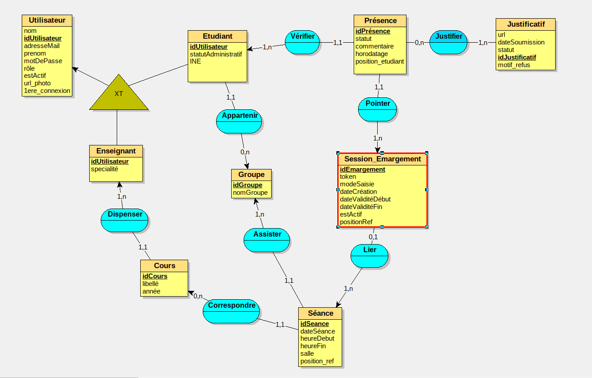
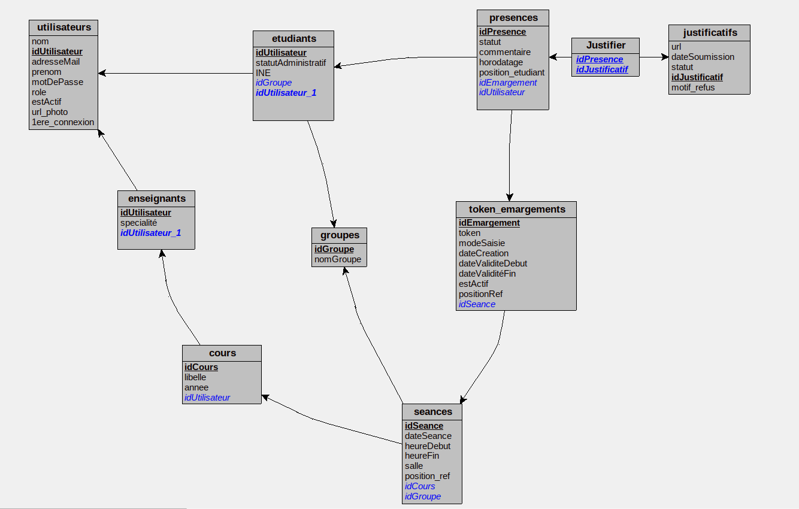
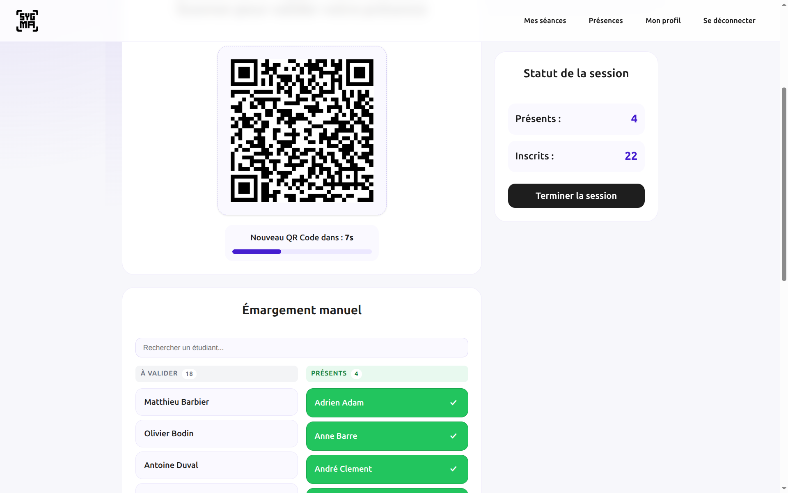
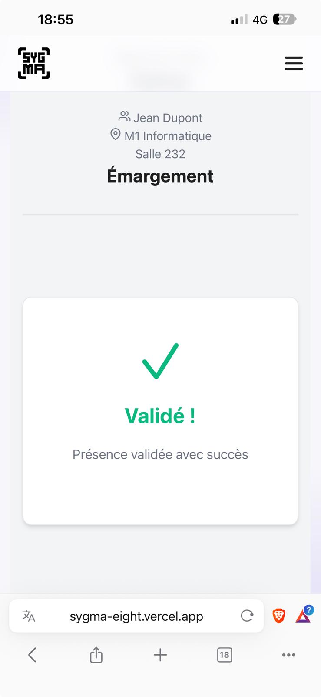
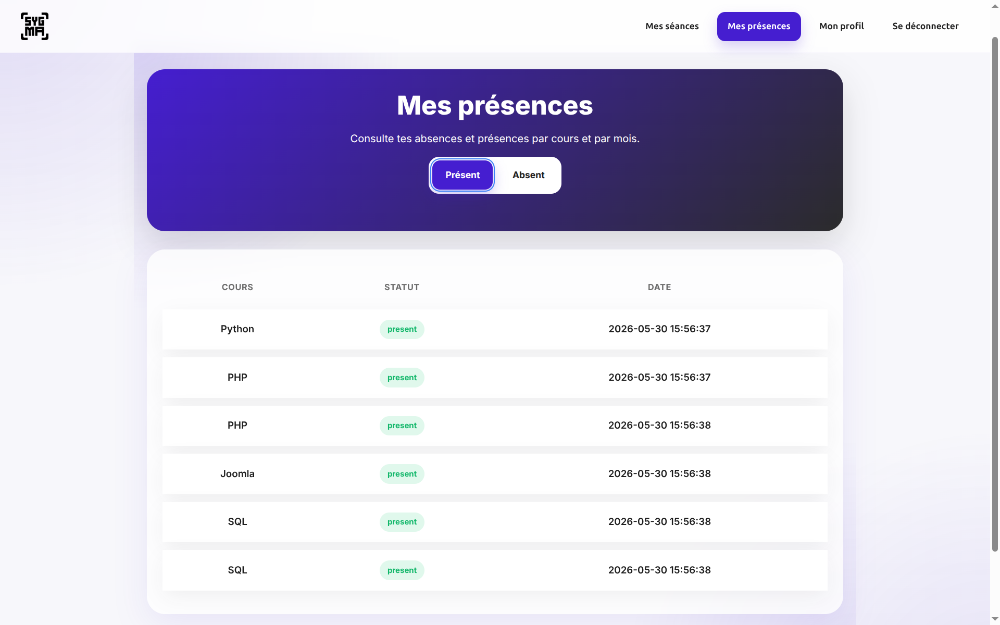
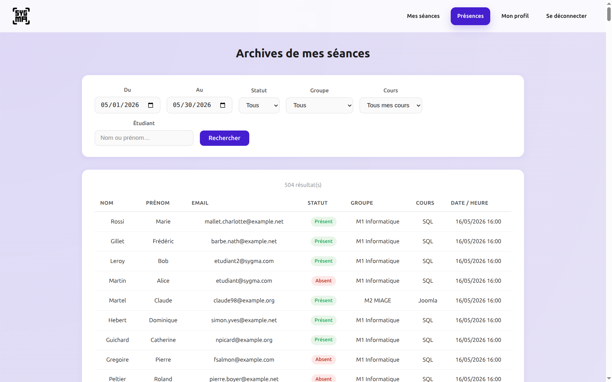
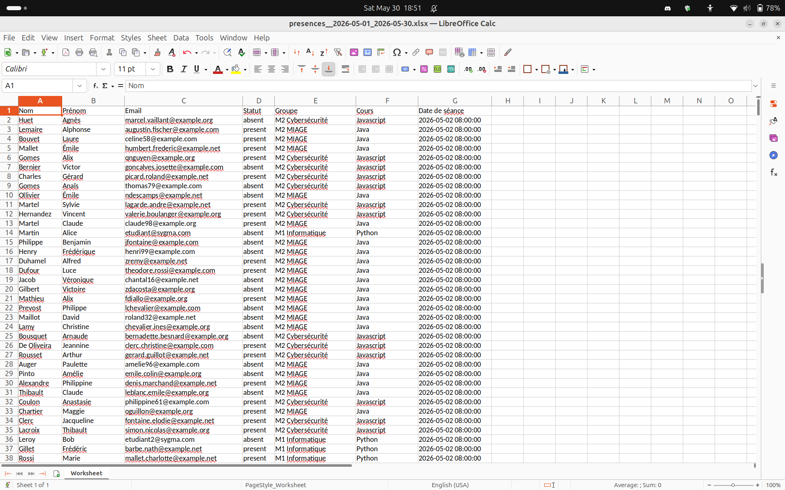
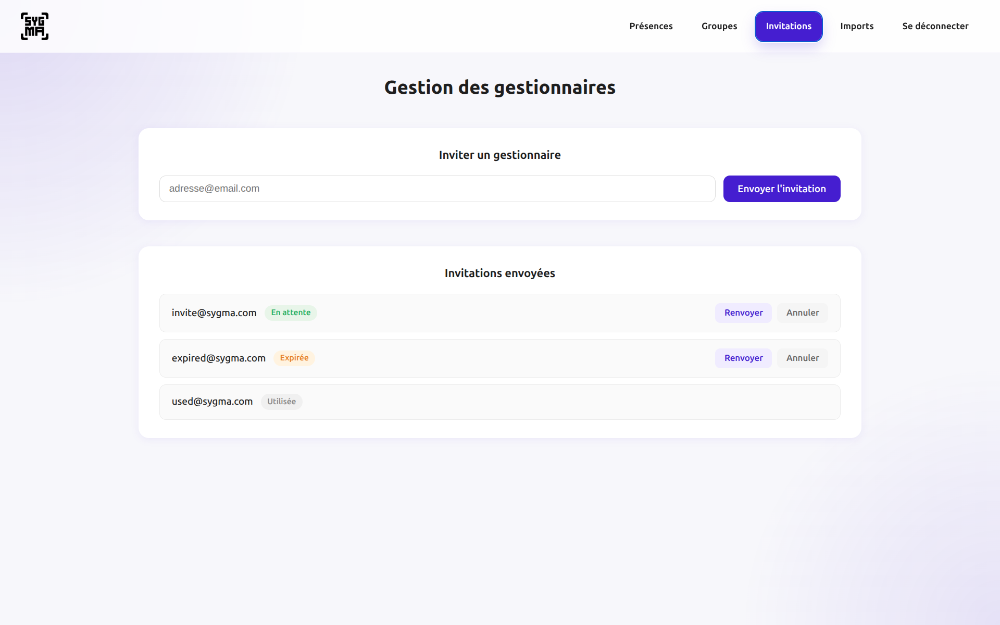

# Sygma
## Application de gestion de présence numérique

**Rapport technique**

Licence Professionnelle Métiers de l'Informatique - Applications Web

IUT [à compléter] - Mai 2026

**Equipe :**
- [Prénom Nom] - Architecture backend, infrastructure Docker, CI/CD, authentification, système QR
- [Prénom Nom] - Frontend
- [Prénom Nom] - Export de données, contrôleur de présences

**Tuteur / Commanditaire :** [Nom du commanditaire], enseignant à l'IUT

---

## Table des matières

1. [Introduction et contexte](#1-introduction-et-contexte)
2. [Organisation du projet](#2-organisation-du-projet)
3. [Analyse des besoins](#3-analyse-des-besoins)
4. [Méthodologie](#4-méthodologie)
5. [Conception et choix techniques](#5-conception-et-choix-techniques)
6. [Réalisation](#6-réalisation)
7. [Difficultés rencontrées](#7-difficultés-rencontrées)
8. [Bilan](#8-bilan)
9. [Perspectives](#9-perspectives)
10. [Annexes](#10-annexes)

---

## 1. Introduction et contexte

### 1.1 Origine du projet

Sygma est une application web de gestion de présence numérique développée dans le cadre d'un projet tutoré de Licence Professionnelle. Le projet a été commandé par un enseignant de l'IUT qui, comme la majorité de ses collègues, gérait les feuilles de présence sous format papier.

Cette pratique, bien qu'établie, présente plusieurs inconvénients concrets :

- **Perte de données** : une feuille peut être égarée, illisible ou détruite
- **Traitement manuel** : la consolidation des données et le calcul des taux d'absence demandent un travail répétitif et chronophage
- **Absence de traçabilité numérique** : retrouver l'historique d'un étudiant sur plusieurs mois est fastidieux
- **Vulnérabilité à la fraude** : un étudiant peut signer à la place d'un absent

### 1.2 Objectif

L'objectif était de remplacer ces feuilles papier par une application web simple, fiable et sécurisée, utilisable aussi bien sur ordinateur (pour l'enseignant) que sur smartphone (pour les étudiants). Le commanditaire a formalisé ses besoins lors d'une réunion de cadrage (cf. Annexe B) dont les exigences principales étaient :

- Gestion des utilisateurs avec droits différenciés par rôle
- Émargement par QR Code ou manuellement par l'enseignant
- Consultation et export des données de présence
- Protection contre la fraude (durée limitée, unicité de l'émargement)
- Interface simple et utilisable sur mobile

### 1.3 Utilisateurs cibles

L'application est destinée à trois profils au sein d'un établissement d'enseignement supérieur :

| Rôle | Profil | Besoins principaux |
|------|--------|--------------------|
| **Etudiant** | Jeune adulte à l'aise avec le smartphone | Scanner un QR Code rapidement, consulter son historique de présences |
| **Enseignant** | Enseignant en cours, debout devant sa classe | Démarrer une session en deux clics, voir en temps réel qui a émargé, valider manuellement les absents |
| **Gestionnaire** | Personnel administratif ou responsable pédagogique | Accéder à toutes les présences, exporter en Excel/PDF, gérer les comptes étudiants |

---

## 2. Organisation du projet

### 2.1 Composition de l'équipe

Le projet a été développé par une équipe de trois étudiants en LP MIAW. La répartition des responsabilités a évolué au cours du projet : au départ assez cloisonnée (un développeur sur le frontend, deux sur le backend), elle a évolué en fin de projet vers un mode feature complète - chaque développeur portant seul le backend et le frontend d'une fonctionnalité.

| Membre | Responsabilités principales |
|--------|----------------------------|
| [Prénom Nom] | Architecture backend, infrastructure Docker, CI/CD, authentification, système QR Code, déploiement Railway |
| [Prénom Nom] | Frontend : interfaces enseignant, étudiant, gestionnaire |
| [Prénom Nom] | Export Excel/PDF, contrôleur de présences, import de comptes |

### 2.2 Durée et jalons

Le projet s'est déroulé de **janvier à juin 2026** (6 mois).

| Date | Jalon |
|------|-------|
| Janvier 2026 | Réunion de cadrage avec le commanditaire - recueil des besoins |
| Janvier-février 2026 | Enquêtes utilisateurs, cahier des charges, modélisation Merise, diagrammes UML |
| Février-mars 2026 | Développement du coeur : authentification, séances, émargement QR |
| Mars-avril 2026 | Développement secondaire : export, import, invitations, CI/CD |
| Avril 2026 | Présentation mi-parcours notée - démonstration au commanditaire |
| Avril-mai 2026 | Finalisation, déploiement Railway/Vercel, tests mobiles |
| Juin 2026 | Soutenance finale |

### 2.3 Communication et outils

**Entre membres de l'équipe**

- **Discord** : canal dédié au projet pour la communication quotidienne (questions techniques, partage de ressources, coordination)
- **Réunions toutes les deux semaines** : point d'avancement, résolution des blocages, planification de la prochaine itération

**Avec le commanditaire**

Trois réunions formelles ont eu lieu :
1. **Réunion de cadrage** (janvier) : présentation du besoin, formalisation du périmètre
2. **Réunion mi-parcours** (avril) : démonstration de l'application, ajustements de périmètre (notamment l'abandon des commentaires retard/excusé)
3. **Réunion finale** (juin) : validation avant soutenance

### 2.4 Gestion du code

- **GitHub** : dépôt central avec branches par fonctionnalité (convention `feat/nom-feature`, `fix/nom-bug`)
- **Issues GitHub** : suivi des tâches et bugs tout au long du projet
- **Pull Requests** : introduites en cours de projet pour les fonctionnalités complexes - elles ont permis une relecture du code avant merge et ont amélioré la qualité des dernières livraisons
- **~255 commits** au total sur la durée du projet
- **CI/CD GitHub Actions** : lint PHP (Pint + PHPCS) et JS (ESLint) sur chaque push, non-bloquant pour ne pas ralentir le développement ; hook pre-commit local pour les corrections automatiques

---

## 3. Analyse des besoins

### 2.1 Recueil des besoins

Les besoins ont été recueillis lors d'une réunion avec le commanditaire, dont la présentation est reproduite en annexe. Cette réunion a permis de formaliser un périmètre clair et d'écarter, en concertation avec le commanditaire, certaines fonctionnalités jugées secondaires - notamment les commentaires "en retard / excusé" - afin de se concentrer sur le coeur du produit livrable dans les délais.

### 2.2 Cas d'usage principaux

**UC1 - Émargement par QR Code (cas nominal)**

1. L'enseignant démarre une session d'émargement depuis son tableau de bord
2. Un QR Code s'affiche à l'écran ; il se régénère automatiquement toutes les 20 secondes
3. Chaque étudiant scanne le QR Code avec son smartphone
4. La présence est enregistrée instantanément ; l'étudiant voit "Validé !"
5. L'enseignant clôture la session à la fin du cours

**UC2 - Émargement manuel**

Quand un étudiant ne peut pas scanner (pas de téléphone, problème réseau), l'enseignant le marque présent directement depuis l'interface de session, sans interrompre l'émargement QR.

**UC3 - Consultation et export**

Le gestionnaire filtre les présences par cours, groupe, date et étudiant, puis exporte les données en Excel ou PDF pour transmission aux services administratifs.

**UC4 - Gestion des comptes**

Le gestionnaire importe les listes d'étudiants via un fichier CSV/Excel. Il invite des collègues gestionnaires par lien email sécurisé.

### 2.3 Périmètre fonctionnel livré

| Fonctionnalité demandée | Statut | Note |
|------------------------|--------|------|
| Émargement QR Code | Livré | Jeton rotatif 20s, anti-fraude géolocalisation |
| Émargement manuel | Livré | - |
| Gestion des séances (CRUD) | Livré | Détection de conflits de créneaux |
| Consultation des présences | Livré | Filtres avancés, pagination |
| Export Excel / PDF | Livré | Maatwebsite Excel + DomPDF |
| Taux de présence | Livré (partiel) | Affiché sur la vue session (présents / inscrits) |
| Connexion Google OAuth | Livré | Ajouté sur suggestion d'un enseignant pour une meilleure UX |
| Import de comptes CSV/Excel | Livré | Transaction tout-ou-rien avec confirmation par email |
| Invitations gestionnaire | Livré | Token 48h, suivi des statuts |
| Commentaires retard/excusé | Ecarté | Décision prise avec le commanditaire, hors périmètre prioritaire |
| Déploiement | Livré | Railway (backend) + Vercel (frontend) |

---

## 4. Méthodologie

Avant d'écrire la moindre ligne de code, l'équipe a suivi une phase de conception structurée couvrant l'enquête utilisateurs, la modélisation des données et la description des scénarios fonctionnels.

### 4.1 Enquêtes utilisateurs

Pour ne pas concevoir l'application en vase clos, trois formulaires Google Forms distincts ont été distribués aux différents profils d'utilisateurs cibles en février 2026.

| Profil | Réponses | Questions clés |
|--------|----------|----------------|
| Etudiants | 18 | Habitudes de présence, appétence pour le QR Code, réseau mobile en salle |
| Enseignants | 3 | Méthode d'émargement préférée, contrainte de temps, besoins de planification |
| Personnel administratif | 4 | Format d'export attendu (PDF, Excel, CSV), données nécessaires |

**Résultats déterminants pour la conception**

L'enquête enseignants a directement influencé deux décisions architecturales majeures :

- **Système mixte QR Code + correction manuelle** : les réponses étaient partagées entre QR Code pur et liste numérique. Nous avons choisi d'implémenter les deux simultanément sur la même interface plutôt que de trancher. Extrait du formulaire (réponse 1 ci-dessous, réponse 2 ci-dessus) :

.pdf)

Un enseignant souhaitait le QR Code seul, un autre le système mixte. Le compromis retenu - QR Code par défaut avec correction manuelle disponible en parallèle - satisfait les deux cas d'usage.

- **Format d'export** : les gestionnaires ont unanimement cité Excel comme format principal, avec PDF en second. Cela a orienté le choix de Maatwebsite Excel + DomPDF plutôt qu'une solution unique.

- **Contrainte de temps** : les enseignants se déclaraient prêts à consacrer **2 à 3 minutes maximum** à la mise en place de l'émargement. Cela a imposé une exigence forte sur l'UX : démarrer une session ne doit pas dépasser 2 clics.

- **Intégration avec l'ENT** : un enseignant a suggéré une connexion avec Hyperplanning (`edt-univ-evry.hyperplanning.fr`). Ce besoin a été noté mais écarté du périmètre initial, et inscrit en perspectives.

### 4.2 Cahier des charges

Suite à la réunion de cadrage avec le commanditaire et à l'analyse des enquêtes, l'équipe a rédigé un cahier des charges formalisant :

- Les cas d'usage par rôle
- Les contraintes techniques (temps de réponse, compatibilité mobile, RGPD)
- Les données manipulées et leur structure attendue
- Les critères d'acceptation de chaque fonctionnalité

Ce document a servi de référence tout au long du développement pour arbitrer les priorités, notamment lors de la décision d'écarter les commentaires retard/excusé en mi-parcours.

### 4.3 Modélisation Merise : MCD et MLD

La modélisation a été réalisée **avant le développement**, selon la méthode Merise, en deux étapes.

**MCD (Modèle Conceptuel de Données)**

Le MCD identifie les entités métier et leurs associations sans contrainte d'implémentation :



Entités principales : `Utilisateur` (avec spécialisations `Etudiant` et `Enseignant` via XT), `Groupe`, `Cours`, `Séance`, `Session_Emargement`, `Présence`, `Justificatif`.

**MLD (Modèle Logique de Données)**

Le MLD traduit le MCD en tables relationnelles avec clés étrangères, directement exploitable pour écrire les migrations Laravel :



**Ecarts entre la modélisation et l'implémentation finale**

La conception initiale a subi plusieurs ajustements en cours de développement :

| Ecart | Raison |
|-------|--------|
| `Justificatif` absent de la base | Fonctionnalité écartée avec le commanditaire (hors périmètre) |
| `Etudiant`/`Enseignant` fusionnés dans `users` + rôles Spatie | Laravel Sanctum + Spatie gèrent la distinction par rôle plus simplement qu'une hiérarchie de tables |
| `token_emargements` renommé `sessions_emargement` | Renommage métier en cours de développement pour refléter le concept de "session" |
| `commentaire` absent de `presences` | Ecarté avec le commentaire retard/excusé |

Ces ajustements sont normaux dans un cycle de développement itératif : le MCD reste la référence conceptuelle, mais l'implémentation s'adapte aux contraintes du framework et aux décisions de périmètre.

### 4.4 Diagrammes UML de séquence

Six scénarios fonctionnels ont été modélisés sous forme de diagrammes de séquence avant le développement. Ils ont servi de spécification pour l'implémentation des endpoints API correspondants.

**Scénario 1 - Authentification**


Le flux nominal décrit la connexion email/password avec redirection selon le rôle. Le bloc `alt` modélise le cas d'échec (identifiants incorrects).

**Scénario 2 - Création d'une séance**


**Scénario 3 - Émargement par QR Code** *(scénario central)*


Ce diagramme a été le plus structurant : il a formalisé le flux complet (génération du jeton, scan, envoi des coordonnées GPS, validation côté serveur, confirmation) et a directement guidé la conception de l'`EmargementService` et de ses exceptions métier (`JetonExpireException`, `EtudiantNonInscritException`, `DejaEmargeException`).

Les trois autres scénarios (gestion des justificatifs, notification de retard, validation par le gestionnaire) ont été modélisés mais partiellement implémentés, les fonctionnalités correspondantes ayant été écartées ou reportées.

### 4.5 Du MLD aux migrations Laravel

Une fois le MLD validé, chaque table a été traduite en migration Laravel. L'ordre des migrations respecte les dépendances de clés étrangères :

```
users -> groupes -> cours -> seances
                          -> sessions_emargement -> presences
users -> invitations_gestionnaire
```

Cette démarche - modéliser d'abord, coder ensuite - a évité les nombreuses migrations correctives qui pénalisent les projets conçus directement dans le code.

---

## 5. Conception et choix techniques


### 3.1 Architecture générale

L'application suit une architecture **client-serveur découplée** :

- Le **frontend** (React) est une SPA qui communique avec le backend exclusivement via des appels HTTP/JSON
- Le **backend** (Laravel) expose une API REST JSON sans logique de rendu
- Les deux couches sont déployées et versionnées indépendamment

Ce découplage correspond à la contrainte du commanditaire ("architecture simple, utilisable sur ordinateur et smartphone") et offre une flexibilité pour l'avenir : une application mobile native pourrait consommer la même API sans modification du backend.

```
Navigateur / Mobile
       |
       | HTTPS / JSON
       v
  API Laravel (/api)
       |
  Routes -> Contrôleurs -> Services -> Modèles Eloquent
                                             |
                                       PostgreSQL
```

Le flux de traitement d'une requête suit systématiquement ce chemin : les **contrôleurs** valident les données entrantes et orchestrent l'appel, les **services** portent la logique métier, les **modèles Eloquent** accèdent à la base de données, et les **API Resources** formatent la réponse JSON avant de la retourner.

### 3.2 Choix du backend : Laravel

**Alternatives considérées :** Node.js/Express, Symfony, Django

Laravel a été retenu pour plusieurs raisons :

1. **Maîtrise de l'équipe** : le framework avait été utilisé en cours de PHP, ce qui a réduit la courbe d'apprentissage et permis de démarrer rapidement sur les fonctionnalités
2. **Richesse de l'écosystème** : Laravel embarque nativement les outils nécessaires - migrations, Eloquent ORM, Sanctum (authentification SPA), envoi d'emails, validation des requêtes
3. **Spatie Laravel Permission** : package mature pour la gestion des rôles (étudiant, enseignant, gestionnaire), évitant de réimplémenter une logique d'autorisation from scratch
4. **Eloquent ORM** : la relation entre les entités (séances, sessions, présences) se modélise naturellement avec les relations Eloquent, produisant un code lisible

Node.js aurait permis de partager du code de validation entre frontend et backend, mais cette économie est marginale à notre échelle.

### 3.3 Choix du frontend : React / Vite

React a été choisi pour sa popularité (ressources abondantes), sa gestion efficace des états dynamiques - la page de session QR en temps réel est un cas d'usage typique - et sa compatibilité avec Vite pour un cycle de développement rapide. React Router DOM gère la navigation entre les espaces (enseignant, étudiant, gestionnaire) avec des routes protégées par rôle.

### 3.4 Choix de la base de données : PostgreSQL

**Alternatives considérées :** MySQL, SQLite (conservé pour les tests)

PostgreSQL a été retenu pour trois raisons :

1. **Extension PostGIS** : la mesure anti-fraude géolocalisation repose sur des calculs de distance géographique (`ST_Distance`, `ST_MakePoint`). PostGIS, l'extension géospatiale de PostgreSQL, gère ces calculs nativement et efficacement. MySQL ne propose pas d'équivalent mature pour ce cas d'usage.
2. **Robustesse et conformité SQL** : PostgreSQL est reconnu pour sa rigueur sur les contraintes d'intégrité et ses performances sur les requêtes complexes avec joins multiples
3. **Open source sans coût de licence** : compatible nativement avec Railway pour le déploiement

### 3.5 Modèle de données

Le modèle central articule trois concepts clés :

- Une **séance** est un cours planifié (enseignant, groupe, salle, horaire)
- Une **session d'émargement** est l'acte d'appel sur une séance donnée
- Une **présence** est l'enregistrement individuel d'un étudiant dans une session

Le découplage séance / session d'émargement était une décision de conception importante. Il permet à un enseignant de relancer un émargement sans perdre l'historique, et de distinguer la présence QR de la présence manuelle (champ `is_methode_qr`).

Le **statut d'une séance** (en cours, à venir, terminée) est calculé à la volée à partir des horaires, et non stocké en base de données. Ce choix évite toute désynchronisation entre l'état réel et la valeur stockée, au prix d'un calcul simple à chaque requête.

### 3.6 Sécurité et anti-fraude

Le principal vecteur de fraude identifié est le **partage de QR Code par messagerie** : un étudiant absent reçoit la photo du code d'un camarade présent. Deux mécanismes y répondent :

1. **Jeton rotatif** : le QR Code expire et se régénère toutes les **20 secondes**. Ce délai résulte d'un équilibre entre le temps de scan acceptable (l'étudiant doit avoir le temps de pointer sa caméra) et la fenêtre de fraude utile (un code partagé par message expire avant que le destinataire ne puisse l'utiliser). Une évolution envisagée serait de laisser l'enseignant choisir cette durée, mais elle n'a pas été implémentée.

2. **Géolocalisation** : lors du scan, les coordonnées GPS du smartphone de l'étudiant sont envoyées au backend et comparées aux coordonnées de la salle enregistrées lors du démarrage de la session. Un étudiant géographiquement hors de la salle ne peut pas émarger.

D'autres protections complètent le dispositif : unicité de l'émargement par étudiant et par session, authentification par cookie Sanctum, vérification d'email obligatoire à l'inscription.

---

## 6. Réalisation

### 4.1 Vue d'ensemble

L'application couvre l'intégralité du cycle de vie d'une feuille de présence numérique : de la planification d'une séance jusqu'à l'export des données consolidées.

**Espace enseignant**
- Tableau de bord des séances avec filtres (statut, cours, groupe, dates) et pagination
- Création, modification et suppression de séances avec détection automatique des conflits de créneaux (même enseignant ou même salle sur le même créneau)
- Session d'émargement en direct : QR Code rotatif et émargement manuel simultanés, compteur présents/inscrits en temps réel
- Archive des présences avec filtres avancés

**Espace étudiant**
- Scan du QR Code directement depuis le navigateur mobile (sans application native installée)
- Consultation de l'historique de ses présences par cours, avec filtre présent/absent

**Espace gestionnaire**
- Vue consolidée de toutes les présences avec filtres (groupe, cours, étudiant, date, statut)
- Export en Excel et PDF
- Import de comptes étudiants en masse via CSV/Excel (validation ligne par ligne, transaction tout-ou-rien)
- Gestion des invitations gestionnaire par email (création, suivi des statuts, relance)

**Authentification**
- Inscription email / mot de passe avec vérification par email
- Connexion Google OAuth 2.0

### 4.2 Organisation du code backend

La logique métier est isolée dans des **classes de service** (`app/Services/`), séparées des contrôleurs. Cette séparation garantit que les contrôleurs restent courts (validation + orchestration) et que la logique est testable indépendamment.

Les erreurs métier sont représentées par des **exceptions personnalisées** organisées par domaine (`app/Exceptions/Emargement/`, `app/Exceptions/Seance/`, etc.), chacune portant sa propre méthode `render()` qui retourne un JSON structuré avec le bon code HTTP. Cette approche centralise la gestion des erreurs et produit une API cohérente.

Les **API Resources** (`app/Http/Resources/`) définissent explicitement les champs exposés dans chaque réponse JSON, évitant toute fuite de données internes (tokens, champs techniques).

### 4.3 Captures d'écran

**Figure 1 - Session d'émargement en cours (vue enseignant)**



L'enseignant dispose d'une vue unifiée : le QR Code avec son compte à rebours (ici 7 secondes avant régénération), le panneau de droite affichant en temps réel présents (4) et inscrits (22), et en bas la liste pour l'émargement manuel. Les deux modes - QR et manuel - fonctionnent simultanément.

---

**Figure 2 - Confirmation de scan (vue étudiant sur mobile)**



Après scan du QR Code, l'étudiant reçoit immédiatement la confirmation "Validé !" avec le contexte de la séance (enseignant, groupe, salle). L'URL `sygma-eight.vercel.app` confirme l'utilisation en environnement de production déployé.

---

**Figure 3 - Mes présences (vue étudiant)**



L'étudiant consulte l'historique de ses présences triées par cours, avec un filtre Présent / Absent pour cibler ses absences.

---

**Figure 4 - Archives des présences (vue enseignant)**



La vue archive permet de filtrer par période, statut, groupe, cours et nom d'étudiant. Les 504 résultats illustrent les données de démonstration générées par les seeders.

---

**Figure 5 - Export Excel des données de présence**



L'export produit un fichier Excel structuré (nom, prénom, email, statut, groupe, cours, date/heure) directement exploitable par les services administratifs sans retraitement.

---

**Figure 6 - Gestion des invitations gestionnaire**



Le gestionnaire invite ses collègues par email. Chaque invitation a un statut visible (En attente, Expirée, Utilisée) avec actions Renvoyer et Annuler. Le lien d'invitation expire après 48 heures.

---

## 7. Difficultés rencontrées

### 5.1 Tests sur mobile : contournement des restrictions CORS

**Problème.** Le frontend (`localhost:3000`) et le backend (`localhost:8000`) sont inaccessibles depuis un smartphone externe. Impossible de tester l'émargement QR sur un vrai téléphone sans infrastructure dédiée.

**Tentative initiale.** La première approche était d'exposer le backend directement via ngrok. Elle a échoué à cause de la politique des cookies Sanctum : en contexte cross-domain (ngrok pour le frontend, localhost pour le backend), les cookies `SameSite=Lax` sont bloqués par les navigateurs mobiles. Safari refusait silencieusement les cookies et retournait une page blanche.

**Solution finale.** Un proxy Vite achemine toutes les requêtes `/api` vers le backend Docker en réseau interne - un seul tunnel ngrok suffit pour le frontend, éliminant le cross-domain.

```javascript
// vite.config.js - ajouté lors du commit 309d0a49
server: {
  proxy: {
    '/api': {
      target: 'http://backend:8000',  // réseau Docker interne
      changeOrigin: true,
    }
  },
  allowedHosts: true,  // autorise les domaines *.ngrok.io
}
```

La commande `make mobile` automatise tout : lancement de ngrok, mise à jour du `.env` backend (CORS, SESSION_DOMAIN, Google OAuth redirect), rebuild du frontend en mode preview, et affichage d'un QR Code dans le terminal pour ouvrir l'URL sur le téléphone.

```
======================================
  Ouvre sur ton téléphone :
  https://xxxx-xx-xx-xx-xx.ngrok-free.app
======================================
[QR code ASCII]
```

`make mobile-stop` restaure l'environnement local en réécrivant les mêmes variables `.env`. Cette solution a nécessité plusieurs itérations et represent un travail de deux jours complets.

---

### 5.2 Problème N+1 avec Eloquent

**Problème.** En chargeant la liste des séances, Eloquent émettait une requête SQL séparée pour chaque relation - enseignant, cours, groupe - de chaque séance. Sur une page de 15 séances, cela représentait **46 requêtes** au lieu de 4. Le problème a été détecté grâce à Laravel Telescope qui affiche en temps réel le journal des requêtes SQL par endpoint.

**Avant (commit bbab0098^) :**

```php
// SeanceService.php - sans eager loading
return $query->orderBy('debut_a', 'asc')->paginate($parPage);
// -> 1 requête pour les séances + N requêtes pour cours + N pour enseignant + N pour groupe
```

**Après (commit bbab0098) :**

```php
// SeanceService.php - avec eager loading
return $query->orderBy('debut_a', 'asc')
    ->with(['cours', 'enseignant', 'groupe'])
    ->paginate($parPage);
// -> 4 requêtes quelle que soit la taille de la page
```

Le même problème existait dans l'endpoint de statut de session d'émargement, où une requête `count()` en doublon s'ajoutait à une boucle sur les étudiants du groupe :

```php
// Avant : presences()->count() recalcule via une nouvelle requête SQL
'nombre_presents' => $session->presences()->count(),

// Après : on exploite la collection déjà chargée en mémoire
$session->load(['seance.groupe.users', 'presences']);
'nombre_presents' => $presences->count(),
```

Un troisième cas subtil : `GroupeResource` chargeait systématiquement tous les étudiants du groupe même quand la liste n'était pas demandée. Correction par `whenLoaded()` qui ne sérialise la relation que si elle a été explicitement chargée :

```php
// Avant : charge tous les étudiants à chaque appel
'etudiants' => EtudiantResource::collection($this->users),

// Après : sérialise seulement si la relation est déjà chargée
'etudiants' => EtudiantResource::collection($this->whenLoaded('users')),
```

---

### 5.3 Contrôle du format des réponses API

**Problème.** Sans dispositif explicite, `response()->json($model)` sérialise le modèle Eloquent entier, y compris les champs sensibles. Voici ce que retournait l'API sur un utilisateur avant la mise en place des API Resources :

```json
{
  "id": 2,
  "nom": "Dupont",
  "prenom": "Jean",
  "email": "enseignant@sygma.com",
  "email_verified_at": "2026-03-14T21:44:08.000000Z",
  "premiere_connexion": 0,
  "verification_token": "a8f3c...",
  "google_id": null,
  "remember_token": null,
  "created_at": "2026-03-14T21:44:08.000000Z",
  "updated_at": "2026-03-14T21:44:08.000000Z"
}
```

Le `verification_token` (clé d'activation email) et d'autres champs internes étaient exposés au frontend.

**Solution.** Mise en place d'API Resources (commit `24e70d24`). Chaque resource définit explicitement les champs exposés :

```php
// Avant SeanceController.php
return response()->json($seances);  // sérialise tout

// Après
return SeanceResource::collection($seances);  // champs contrôlés
```

```php
// app/Http/Resources/EnseignantResource.php
public function toArray(Request $request): array
{
    return [
        'id'     => $this->id,
        'nom'    => $this->nom,
        'prenom' => $this->prenom,
        // email, token, google_id, etc. : absents volontairement
    ];
}
```

```php
// app/Http/Resources/SeanceResource.php
public function toArray(Request $request): array
{
    return [
        'id'             => $this->id,
        'debut_a'        => $this->debut_a,
        'fin_a'          => $this->fin_a,
        'salle'          => $this->salle,
        'statut'         => $this->statut,
        'nombre_inscrits' => $this->nombre_inscrits,
        'statut_session' => match (true) {
            $this->session_ouverte > 0 => 'ouverte',
            $this->session_existe > 0  => 'cloturee',
            default                    => 'non_demarree',
        },
        'cours'      => new CoursResource($this->cours),
        'enseignant' => new EnseignantResource($this->enseignant),
        'groupe'     => new GroupeResource($this->groupe),
    ];
}
```

---

### 5.4 Environnement Docker sur Windows

**Problème.** L'environnement Docker fonctionnait sans friction sous Linux, mais les membres de l'équipe sous Windows ont bloqué à chaque étape de l'installation :

- Scripts shell (`.sh`) avec des fins de ligne CRLF Windows - Linux les rejette avec `bad interpreter`
- Docker Desktop requis avec WSL2, non activé par défaut sur les machines de l'université
- Clone du projet dans `C:\Users\...` - Docker monte les volumes avec des performances dégradées et des problèmes de permissions

**Solutions apportées :**

Forçage de LF sur tous les fichiers via `.gitattributes` :
```
# .gitattributes
* text=auto eol=lf
*.sh text eol=lf
```

Documentation d'installation dédiée par OS (commit `d083f599`), avec avertissement explicite sur l'emplacement du clone :

> **Important :** Ne clonez pas le projet dans vos dossiers Windows (`C:\Users\...`). Le code doit résider dans le système de fichiers Linux WSL pour que Docker soit performant.

Malgré ces corrections, le setup Windows a représenté plusieurs heures perdues pour chaque nouveau développeur. C'est la difficulté qui a eu le plus d'impact sur la productivité de l'équipe.

---

### 5.5 Déploiement sur Railway

**Problème.** Railway n'utilise pas Docker Compose - il faut un Dockerfile autonome. Le premier essai avec RailPack (l'outil de build automatique de Railway) a échoué au démarrage car FrankenPHP cherchait un `Caddyfile` absent :

```
# Erreur au démarrage - commit a65a7103
frankenphp: could not load Caddyfile: ...
connection timeout
```

**Solutions :**

- Rédaction d'un `Dockerfile.prod` multi-étapes adapté à Railway, avec un `start.sh` qui orchestre les migrations et le démarrage de Laravel
- Configuration des cookies Sanctum pour un contexte cross-domain : le frontend (Vercel, domaine `*.vercel.app`) et le backend (Railway, domaine `*.railway.app`) sont sur des domaines différents. Il a fallu configurer `SESSION_SAME_SITE=none`, `SESSION_SECURE_COOKIE=true` et `SANCTUM_STATEFUL_DOMAINS` correctement - une combinaison qui a nécessité plusieurs déploiements d'essai
- Gestion de la clé OAuth Google : en production, le `GOOGLE_REDIRECT_URI` doit pointer vers le domaine Vercel, pas localhost

---

### 5.6 Polling vs. WebSockets pour la session en temps réel

**Problème.** La page de session doit mettre à jour le compteur de présents chaque fois qu'un étudiant scanne. L'implémentation retenue est un polling toutes les 5 secondes :

```javascript
// frontend/src/pages/Enseignant/SessionQR.jsx
const intervalleStatut = setInterval(fetchStatut, 5000);
```

`fetchStatut` déclenche une requête HTTP vers `/sessions-emargement/{id}/statut` qui renvoie l'état complet de la session (jeton actuel, liste des étudiants, présents/absents).

**Limites de cette approche :**
- Pendant un cours de 2h avec 22 étudiants, cela génère ~1440 requêtes HTTP inutiles (la plupart ne constatent aucun changement)
- La latence d'affichage peut atteindre 5 secondes : un étudiant qui vient de scanner n'apparaît pas immédiatement dans la liste de l'enseignant

**Pourquoi pas WebSockets ?** Laravel Reverb (WebSockets natif Laravel) aurait résolu ces problèmes avec une connexion persistante et des événements push. La raison du non-choix est pragmatique : Reverb nécessite un serveur supplémentaire, une configuration de broadcasting, et des modifications côté frontend pour gérer les événements. Ce surcoût de mise en place dépassait le temps disponible pour cette fonctionnalité.

---

## 8. Bilan

### 6.1 Ce qui fonctionne

- **Le coeur fonctionnel est complet et déployé** : le cycle de vie d'une feuille de présence est entièrement numérisé - de la création d'une séance jusqu'à l'export des données
- **L'anti-fraude est opérationnelle** : la combinaison jeton rotatif + géolocalisation couvre les cas de fraude les plus courants identifiés avec le commanditaire
- **L'API est propre et stable** : les API Resources garantissent un format de réponse cohérent sur tous les endpoints ; les exceptions métier retournent des codes HTTP appropriés
- **La CI/CD est en place** : GitHub Actions pour le lint (PHP et JS) sur chaque push, hook pre-commit local
- **L'application est responsive** : fonctionnelle sur smartphone sans application native

### 6.2 Ce qui manque

- **Les commentaires d'absence** (retard, excusé, justifié) ont été écartés par accord avec le commanditaire, mais représenteraient une valeur ajoutée réelle pour les services administratifs
- **Le taux de présence global** : affiché par session mais pas en vue consolidée par étudiant ou par cours sur une période donnée
- **Les notifications** : aucune alerte automatique en cas d'absences répétées ou de seuil franchi
- **L'administration des comptes** par le gestionnaire (modification, désactivation) n'est que partielle

### 6.3 Ce que nous referions différemment

**WebSockets dès le départ.** Le polling toutes les 5 secondes était acceptable pour un MVP, mais pour une utilisation réelle, la solution WebSockets (Laravel Reverb) aurait dû être intégrée dès la conception de la page de session. La réécriture ultérieure sera plus coûteuse qu'une conception initiale correcte.

**Architecture Docker plus légère.** L'environnement Docker actuel comporte beaucoup de services (PHP, Node, PostgreSQL, Adminer, Mailpit, Nginx, Ngrok) et une configuration réseau complexe. Pour un projet étudiant avec des collaborateurs sur Windows, un `docker-compose.yml` minimal pour démarrer (juste la base de données), complété progressivement, aurait évité de nombreuses heures perdues en configuration.

**Durée du jeton QR paramétrable.** La valeur de 20 secondes est une constante codée en dur (`DUREE_VALIDITE_JETON`). Laisser l'enseignant choisir (10s / 20s / 30s selon le contexte) aurait été une amélioration UX à forte valeur perçue pour un coût de développement faible.

**Organisation en features full-stack plus tôt.** La répartition initiale "une personne sur le front, deux sur le back" a créé des silos et des dépendances qui ont ralenti certaines livraisons. La transition vers un travail par feature complète (back + front d'une fonctionnalité par développeur) adoptée en fin de projet était meilleure et aurait gagné à être mise en place plus tôt.

---

## 9. Perspectives

Si le projet devait continuer, les évolutions prioritaires seraient les suivantes.

**Court terme**

- Remplacement du polling par des **WebSockets** (Laravel Reverb) pour la page de session, afin d'avoir des mises à jour instantanées côté enseignant dès qu'un étudiant émarget et de réduire significativement la charge serveur (le polling actuel génère ~1 440 requêtes HTTP par session de 2h)
- **Statut "en retard"** : permettre à l'enseignant de marquer un étudiant comme présent mais en retard, avec horodatage. Ce statut manquant a été écarté avec le commanditaire en cours de projet mais représente une valeur ajoutée réelle pour les services administratifs
- **Commentaires de présence** : permettre à l'enseignant d'ajouter un commentaire libre sur une présence (motif de retard, observation), en complément du statut. La colonne `commentaire` est absente du modèle actuel et devrait être ajoutée à la table `presences`
- Vue **taux de présence consolidé** par étudiant et par cours sur une période choisie

**Moyen terme**

- **Vue calendrier** : afficher les séances sous forme de calendrier hebdomadaire ou mensuel plutôt qu'une liste paginée, pour l'enseignant comme pour l'étudiant. La donnée est déjà disponible (dates de début et de fin de chaque séance) - c'est une évolution purement frontend
- **Notifications automatiques** : alerte email ou push à l'étudiant en cas d'absences répétées, notification à l'enseignant si le taux de présence d'un groupe passe sous un seuil configurable. Le driver Resend est déjà en place pour l'envoi d'emails
- **Durée du jeton QR paramétrable** par l'enseignant, au démarrage de chaque session
- **Statistiques avancées** : tableau de bord graphique pour le gestionnaire (évolution du taux de présence, comparaison par groupe, alertes)
- **Application mobile native** : l'architecture REST découplée de Sygma a été conçue dès le départ pour permettre ce type d'évolution - le backend n'aurait pas à être modifié en profondeur. Les fonctionnalités étudiantes (scan QR, consultation des présences) constituent un périmètre naturel et limité pour un MVP mobile. Trois points d'adaptation techniques ont été identifiés : le stockage des jetons d'authentification (localStorage n'existe pas en natif, à remplacer par un stockage sécurisé), le flux Google OAuth (les redirects web sont incompatibles avec une app native et nécessitent un flow par deep link), et la caméra QR (les APIs web actuelles avec leurs contournements iOS disparaissent au profit d'APIs natives plus fiables). Ce chantier représente un volume de travail cohérent avec un projet tutoré dédié.

**Long terme**

- **Intégration avec les systèmes de l'établissement** (ENT, annuaires LDAP) pour importer automatiquement groupes et emplois du temps, supprimant la saisie manuelle
- **Module de justification d'absence** : permettre à un étudiant de soumettre un justificatif a posteriori, avec circuit de validation par l'enseignant ou le gestionnaire

---

## 10. Annexes

### Annexe A - Documentation technique

La documentation technique complète (~25 pages) est disponible dans le dépôt à `docs/doc_technique.md`. Elle couvre :

- Stack technique et versions
- Infrastructure Docker : services, ports, commandes Makefile
- Architecture générale et flux de traitement
- Modèle de données détaillé (schéma + description de chaque table)
- Architecture backend : Services, Exceptions, API Resources
- Architecture frontend : pages, routing par rôle
- API REST complète : tous les endpoints, paramètres, codes d'erreur
- Gestion des erreurs HTTP et format de réponse
- Authentification et autorisations (Sanctum + Spatie)
- Tests PHPUnit
- CI/CD : GitHub Actions + hook pre-commit local
- Tests sur mobile (ngrok)
- Sécurité : OWASP, anti-fraude QR, import de comptes

### Annexe B - Présentation commanditaire

La présentation initiale du projet par le commanditaire est fournie en document joint (`presentation_projet_commanditaire.pptx`). Elle couvre les objectifs, le périmètre, les fonctionnalités attendues et les contraintes du projet.

### Annexe C - Perspectives d'évolution mobile

*À destination de l'équipe qui reprendra le projet pour développer l'application mobile native.*

**Périmètre recommandé**

L'espace étudiant est le candidat naturel pour un MVP mobile : les étudiants utilisent Sygma exclusivement sur smartphone pour deux actions - scanner un QR Code et consulter leur historique de présences. Les espaces enseignant et gestionnaire restent sur le web (interactions complexes, usage sur ordinateur).

**Ce qui est déjà prêt**

L'architecture REST découplée a été conçue pour permettre cette évolution : le backend expose une API JSON consommée via Bearer token, sans logique de rendu. Une app mobile native peut consommer exactement la même API sans modification backend. La documentation des endpoints est disponible dans `docs/doc_technique.md`.

**Points d'adaptation obligatoires**

- **Stockage du token.** Le frontend web utilise `localStorage` pour persister le token d'authentification. Cette API n'existe pas sur mobile natif - le token doit être stocké dans un espace sécurisé fourni par la plateforme (Keychain sur iOS, Keystore sur Android).
- **Google OAuth.** Le flow actuel repose sur des redirects web vers une URL de callback. Ce mécanisme est incompatible avec une app native - il faudra implémenter le flow PKCE avec un deep link et adapter l'endpoint `/api/auth/google/finaliser`. C'est le seul point d'adaptation significatif côté backend.
- **Caméra QR.** L'implémentation web actuelle embarque de nombreux contournements pour iOS Safari. Sur mobile natif, les APIs caméra sont directes et fiables - tous ces contournements disparaissent.

**Points de vigilance**

- **Jeton rotatif.** Le QR Code encode une URL contenant un paramètre `jeton` qui expire toutes les 20 secondes. L'app doit parser cette URL, extraire le jeton et envoyer immédiatement la requête de validation avec les coordonnées GPS.
- **Géolocalisation - fonctionnalité incomplète.** Le frontend collecte les coordonnées GPS et les envoie au backend, mais la validation côté serveur (calcul de distance entre la position de référence de la salle et la position de l'étudiant) n'est pas terminée. Cette logique est à compléter dans `EmargementService`.
- **Vérification email.** L'inscription requiert une vérification par email avant la première connexion - l'app mobile doit prévoir un écran d'attente adapté.

**Recommandation**

Privilégier un framework cross-platform (iOS + Android avec une seule base de code). Le choix du framework est laissé à la prochaine équipe selon ses compétences - l'API REST n'impose aucune contrainte technologique côté client.

---

*Rapport technique - Sygma - Licence Professionnelle Métiers de l'Informatique - Applications Web - Mai 2026*
